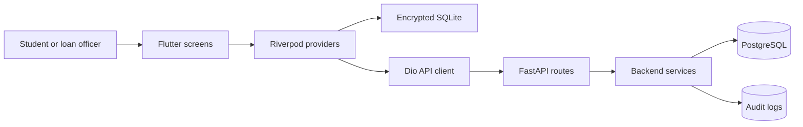
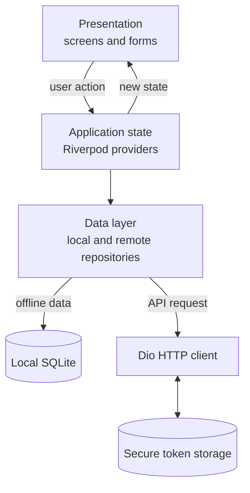
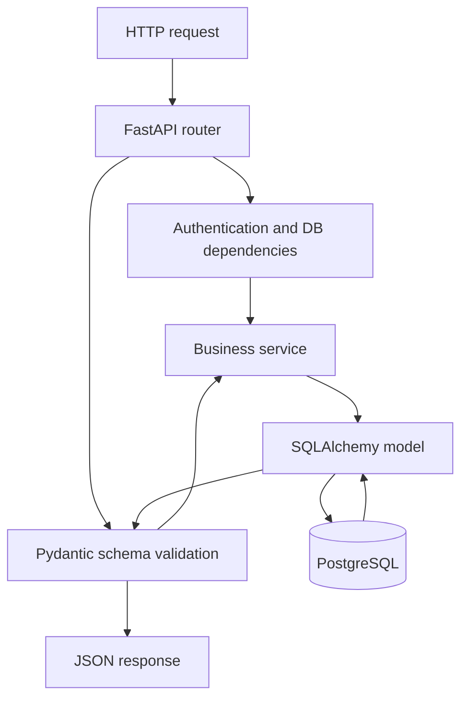
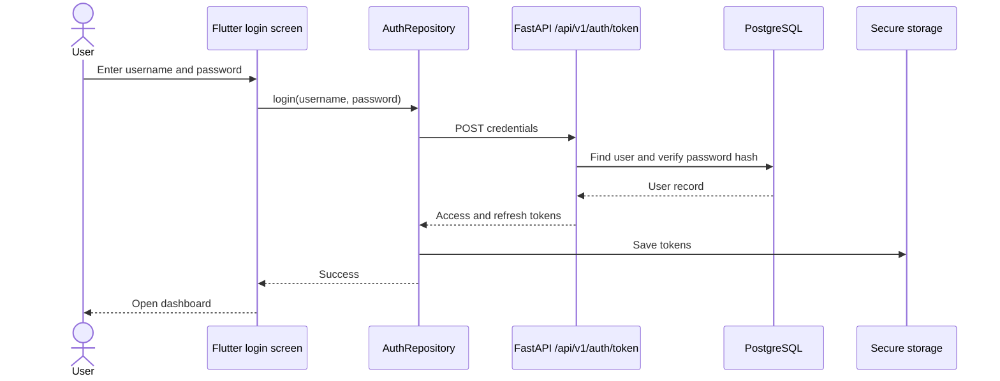
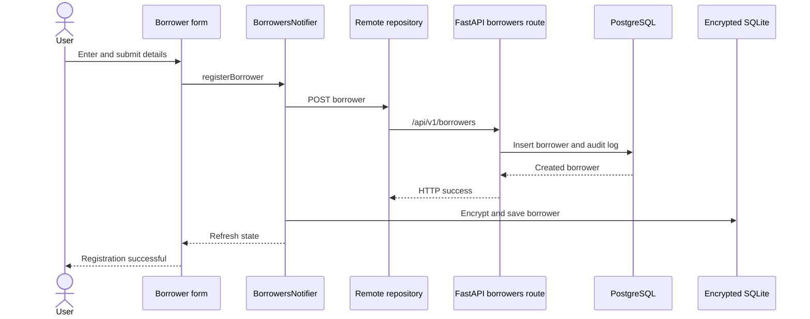
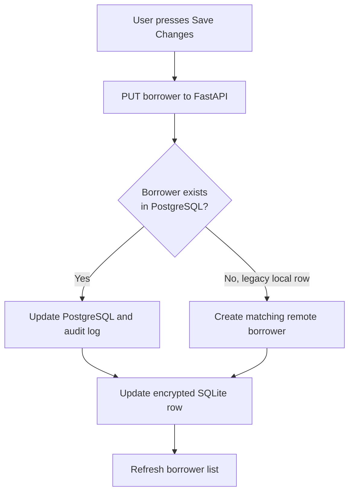
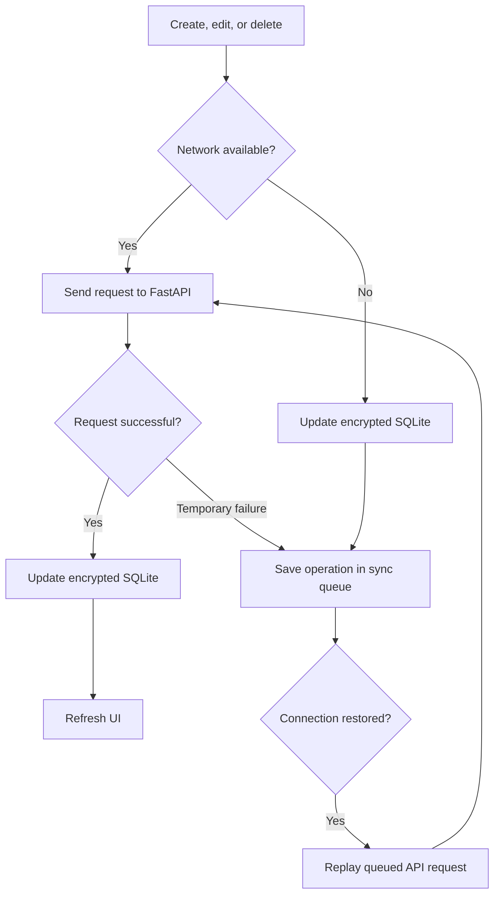
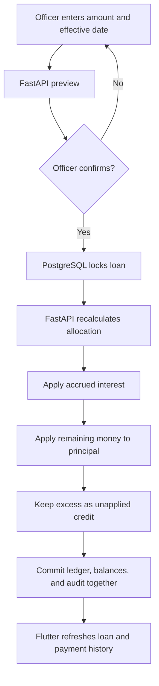
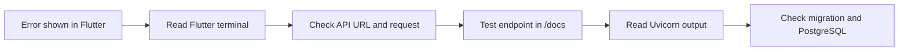

# Frontend and Backend Visual Flow

This document shows how the Flutter frontend and FastAPI backend work together.
Follow the arrows to understand which file or layer receives data next.

## 1. Whole system

The frontend never connects directly to PostgreSQL. FastAPI is the security and
validation boundary between the mobile app and the central database.

## 2. Flutter frontend layers

Important frontend locations:

| Layer | Location | Responsibility |
| --- | --- | --- |
| Screens | `lib/features/**/presentation/` | Displays data and collects input |
| State | `presentation/providers/` | Coordinates loading and mutations |
| Local data | `borrower_repository.dart` | Encrypts and stores SQLite rows |
| Remote data | `remote_borrower_repository.dart` | Sends borrower API requests |
| Networking | `lib/core/network/` | Base URL, tokens, retries, and sync queue |

## 3. FastAPI backend layers

Important backend locations:

| Layer | Location | Responsibility |
| --- | --- | --- |
| Application | `backend/app/main.py` | Creates FastAPI and registers routers |
| Routers | `backend/app/routers/` | Defines URLs and HTTP responses |
| Schemas | `backend/app/schemas/` | Validates request and response data |
| Services | `backend/app/services/` | Applies business rules and audit logging |
| Models | `backend/app/models/` | Maps Python objects to PostgreSQL tables |
| Migrations | `backend/alembic/` | Versions database structure changes |

## 4. Login flow

Plain passwords are sent only to the login endpoint and are not persisted by
Flutter or PostgreSQL. PostgreSQL stores a password hash.

## 5. Register borrower flow

## 6. Edit borrower flow

The fallback path migrates borrowers created by older app versions that stored
records only in SQLite.

## 7. Offline mutation flow

SQLite lets the officer keep working without internet. PostgreSQL remains the
central shared database, so queued changes must eventually synchronize.

## 8. Payment flow

## 9. Student debugging path

Debug one layer at a time. First confirm the UI input, then the API address,
the backend response, and finally the database state.
