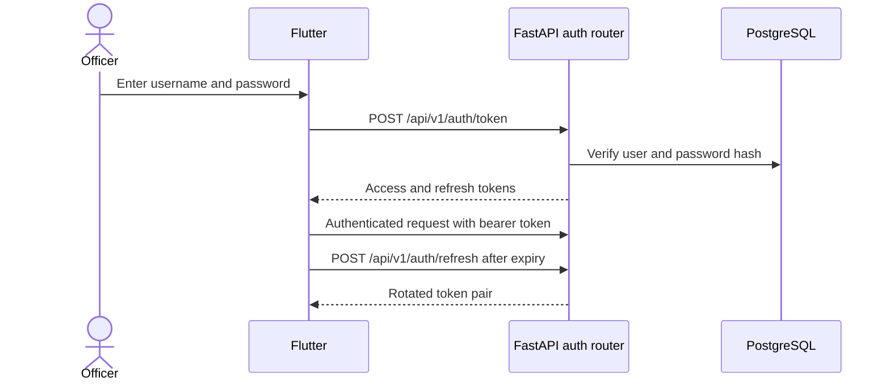
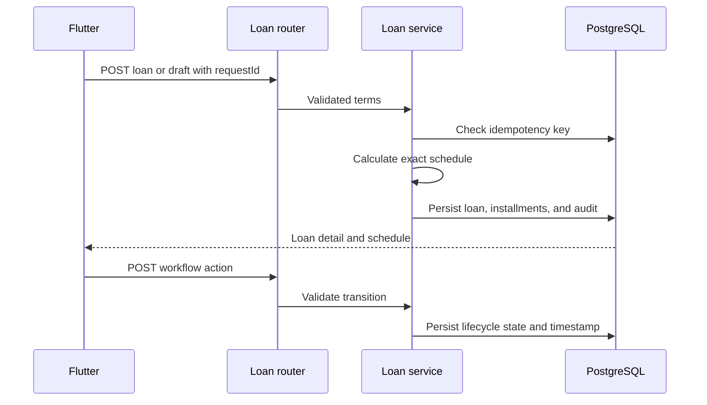
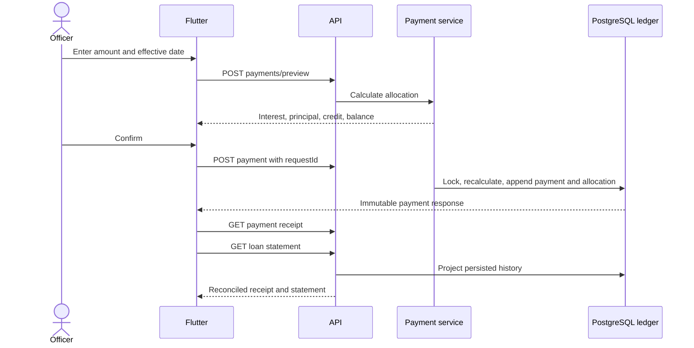
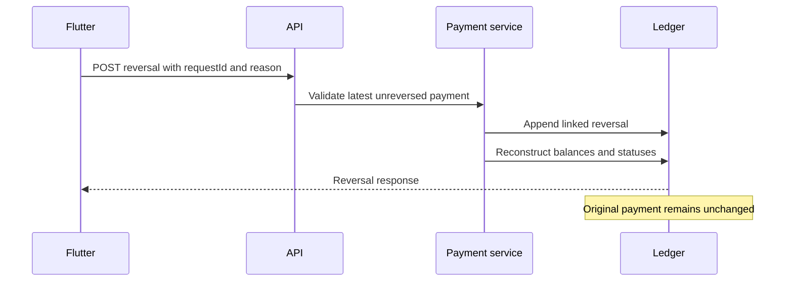
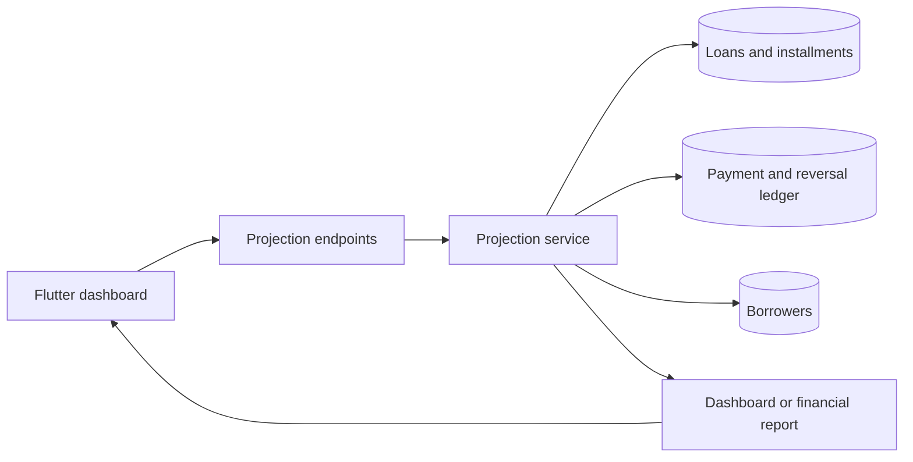
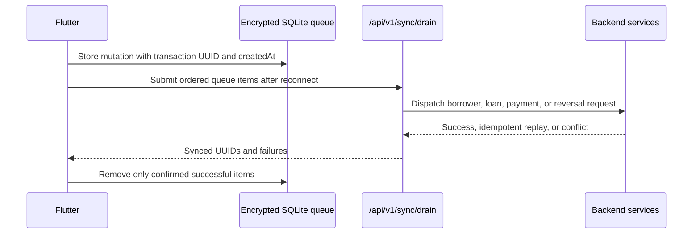

# Application Data Flows

These diagrams describe current behavior. See [System Overview](SYSTEM_OVERVIEW.md) for ownership boundaries.

## Authentication

## Loan creation and workflow

## Payment, receipt, and statement

## Payment reversal

## Dashboard and reports

## Offline synchronization

## Debugging path

Trace failures in this order:

1. Flutter screen input and displayed error.
2. Riverpod notifier state.
3. Repository request and local queue record.
4. FastAPI route and Pydantic validation.
5. Backend service rule.
6. PostgreSQL ledger and audit record.
7. Projection reconciliation response.
