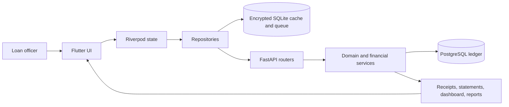

# System Overview

Lending Nelson is a Flutter client backed by a FastAPI service and PostgreSQL. SQLite supports encrypted local caching and an offline mutation queue; it is not the financial source of truth.



## Responsibility boundaries

| Layer | Owns |
| --- | --- |
| Flutter presentation | Input, navigation, loading/error states, and displaying backend results |
| Riverpod and repositories | Client state, authenticated requests, local cache, and retry orchestration |
| FastAPI routers | Authentication, validation boundary, status codes, and response schemas |
| Backend services | Business rules, Decimal calculations, workflow validation, and reconciliation |
| PostgreSQL | Durable borrowers, loans, schedules, immutable payments, reversals, and audits |
| Projection services | Receipt, statement, dashboard, and report views derived from ledger data |

## Sources of truth

- API contract: FastAPI routes, Pydantic schemas, and `/openapi.json`.
- Financial values: backend services using exact `Decimal` arithmetic.
- Current balances and history: persisted PostgreSQL ledger data.
- Local offline state: encrypted SQLite until successfully synchronized.
- Product policy: [Loan and payment rules](../domain/LOAN_AND_PAYMENT_RULES.md).

Flutter must not independently calculate authoritative balances, allocations, receipts, statements, dashboard totals, or reports.

## Main backend modules

```text
backend/app/
├── routers/       HTTP endpoints
├── schemas/       Pydantic request and response contracts
├── services/      Business rules and projections
├── models/        Async SQLAlchemy mappings
├── dependencies.py
├── database.py
└── main.py
```

## Main client modules

```text
lib/
├── app/           App shell, theme, and routing
├── core/          Networking, storage, security, and shared utilities
└── features/      Feature-oriented presentation, domain, and data layers
```
