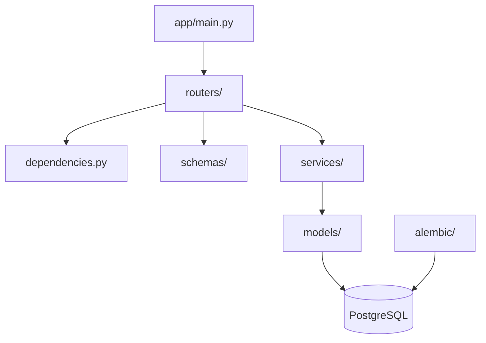
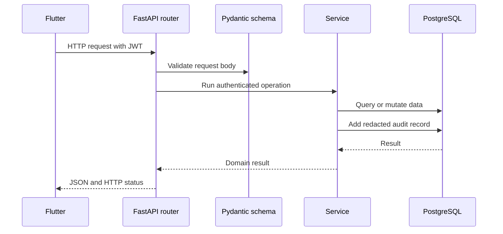

# FastAPI Backend Study Guide

This path teaches the server side of Lending Nelson. FastAPI authenticates
users, validates requests, applies business rules, records audits, and stores
central data in PostgreSQL.

## Learning goals

By the end of this path, you should understand how to:

- create REST endpoints with FastAPI;
- validate JSON with Pydantic schemas;
- authenticate users with password hashes and JWTs;
- organize database work with SQLAlchemy services;
- version PostgreSQL changes with Alembic;
- record redacted audit logs; and
- test endpoints through Swagger.

## Backend map



| Folder or file | What to study |
| --- | --- |
| `backend/app/main.py` | FastAPI creation, middleware, and router registration |
| `backend/app/config.py` | Environment-based settings |
| `backend/app/database.py` | Async SQLAlchemy sessions |
| `backend/app/dependencies.py` | Authentication and request dependencies |
| `backend/app/routers/` | HTTP endpoints and status codes |
| `backend/app/schemas/` | Request and response validation |
| `backend/app/services/` | Authentication, borrower rules, and audit logging |
| `backend/app/models/` | PostgreSQL table mappings |
| `backend/alembic/` | Database migrations |

## Recommended reading order

1. `backend/app/main.py`
2. `backend/app/config.py`
3. `backend/app/database.py`
4. `backend/app/models/user.py`
5. `backend/app/services/auth_service.py`
6. `backend/app/dependencies.py`
7. `backend/app/routers/auth.py`
8. `backend/app/schemas/borrower.py`
9. `backend/app/routers/borrowers.py`
10. `backend/app/services/borrower_service.py`

## Request lifecycle



## Idempotent loan creation

Every Flutter loan submission includes a UUID `requestId`. PostgreSQL stores it
in `loans.request_id` under a unique constraint. FastAPI follows these rules:

1. A new UUID creates and returns one loan and schedule.
2. Retrying the same UUID with identical terms returns that existing loan.
3. Reusing the UUID with different terms returns HTTP 409.
4. Concurrent inserts are resolved by PostgreSQL, not timing assumptions.

The live concurrency test is intentionally opt-in because it writes temporary
rows to the configured PostgreSQL database and then removes only those rows:

```powershell
$env:RUN_POSTGRES_INTEGRATION='1'
python -m unittest tests.test_loan_idempotency_postgres -v
```

## Payment lifecycle

Payment confirmation never accepts calculated interest or principal from
Flutter. FastAPI locks the loan row and recalculates inside one transaction:

```mermaid
sequenceDiagram
    participant Flutter
    participant API as Payment router
    participant Service as Payment service
    participant PG as PostgreSQL
    Flutter->>API: POST payments/preview
    API->>Service: Calculate without saving
    Service-->>Flutter: Interest and principal preview
    Flutter->>API: POST payment with requestId
    API->>PG: Lock loan row
    API->>Service: Recalculate authoritative allocation
    Service->>PG: Insert ledger and audit; update balances
    PG-->>Flutter: Immutable payment response
```

Allocation order is accrued interest, principal, then unapplied credit. A
unique request UUID makes unchanged retries safe. Run the live checks with:

```powershell
$env:RUN_POSTGRES_INTEGRATION='1'
python -m unittest tests.test_loan_idempotency_postgres tests.test_payment_idempotency_postgres -v
```

## Payment reversal lifecycle

The reversal endpoint is
`POST /api/v1/loans/{loanId}/payments/{paymentId}/reversal`. It requires a
unique request UUID, effective date, and reason. The service locks the loan,
requires the latest unreversed payment, creates a linked reversal entry, and
reconstructs balances and statuses in the same transaction.

The original payment is never edited or deleted. History therefore reads as:

```text
Payment -> Reversal -> Corrected payment (when needed)
```

This preserves the reason, actor, timestamps, and exact before/after allocation
snapshots needed to audit the balance.

## Run and verify

From `backend/`:

```powershell
.\.venv\Scripts\Activate.ps1
python -m alembic upgrade head
python -m uvicorn app.main:app --reload
```

Useful addresses:

- Health: `http://127.0.0.1:8000/health`
- Swagger: `http://127.0.0.1:8000/docs`
- OpenAPI: `http://127.0.0.1:8000/openapi.json`

Useful checks:

```powershell
python -m alembic check
python -m compileall app
```

## Backend exercises

1. Add a borrower search query parameter.
2. Add a Pydantic validation rule and observe HTTP 422.
3. Add pagination metadata to the borrower response.
4. Write an Alembic migration for a new non-sensitive field.
5. Add an API test for unauthorized borrower access.

Continue with the shared [Visual Flow](../VISUAL_FLOW.md) or switch to the
[Frontend Study Guide](../frontend/README.md).
