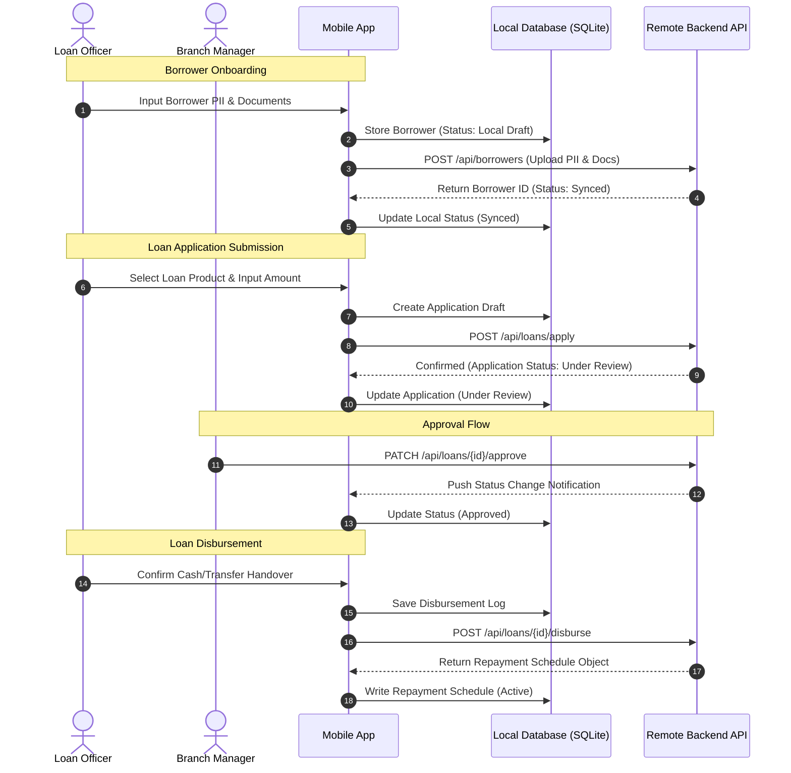
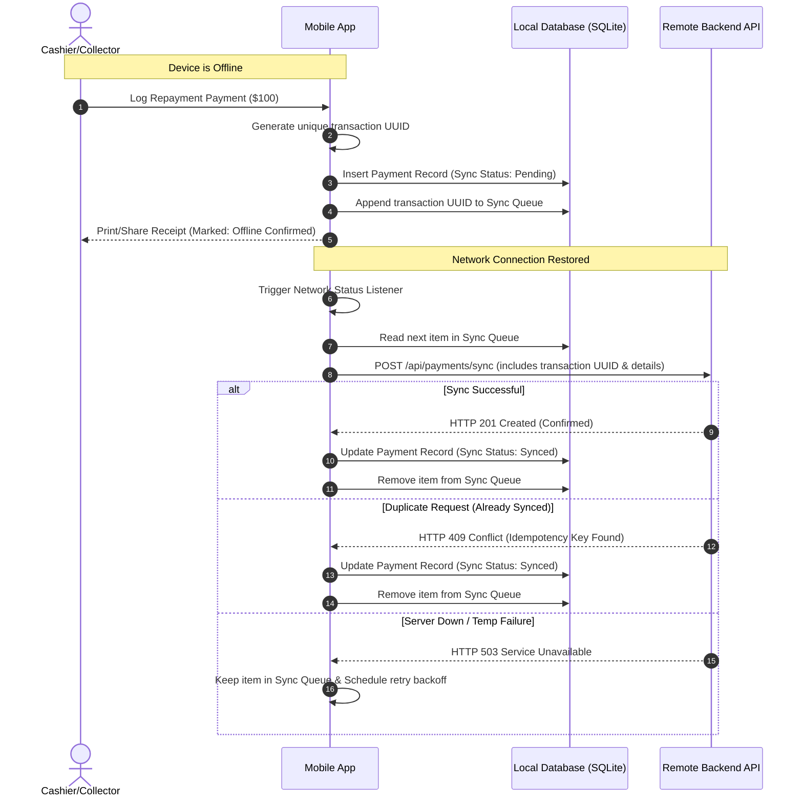

# Data Flow - Lending Nelson

This document describes the sequence of data transfers and states across the client application, local storage, and the backend service.

---

## 🔄 Loan Lifecycle Data Flow

The following diagram illustrates the standard progression from borrower registration to loan closure.

---

## 🛜 Offline Payments Synchronization Flow

When payments are recorded offline, they are queued and synchronized when connectivity is restored.

