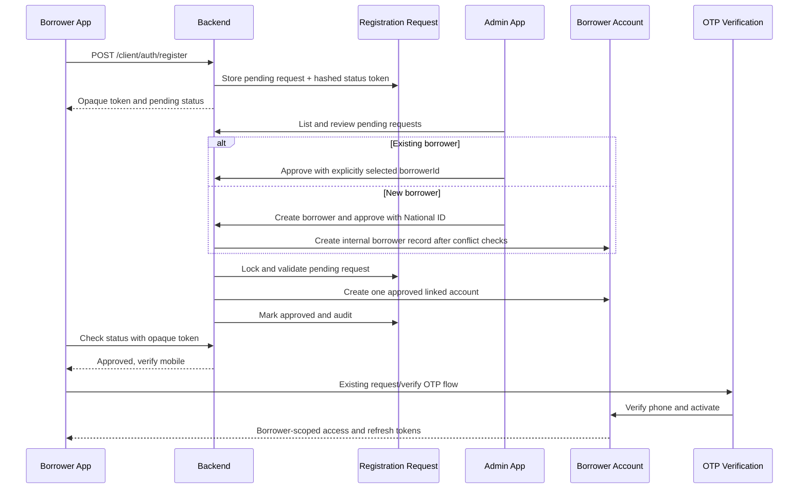

# Borrower self-registration and approval

Borrower self-registration creates an isolated `pending` registration request. It never creates or links a borrower account and never grants access to financial data. An authenticated manager, admin, or owner must either explicitly select an eligible existing borrower, or explicitly choose **Create borrower and approve** and supply the internal National ID. Officers do not have review permission under the current policy.

## States and permissions

Registration states are `pending`, `approved`, `rejected`, `cancelled`, and `expired`. Account states used by this workflow are `approved`, `active`, `suspended`, and `disabled`. Only `active` accounts pass the borrower portal authorization dependency. Managers can approve and reject; admins and owners can additionally suspend, reactivate, disable, and relink. Relinking is permitted only while an account is disabled and revokes all refresh sessions.

## API

- `POST /api/v1/client/auth/register` — public, rate-limited strict submission.
- `POST /api/v1/client/auth/registration-status` — rate-limited lookup by opaque token hash.
- `GET /api/v1/borrower-registration-requests` and `/{request_id}` — staff review queue/detail.
- `POST /api/v1/borrower-registration-requests/{request_id}/approve|reject` — transactional decision.
- `POST /api/v1/borrower-accounts/{account_id}/suspend|reactivate|disable|relink` — admin account lifecycle.

- `POST /api/v1/borrower-registration-requests/{request_id}/create-and-approve` — atomically create the internal borrower record, link the account, approve, and audit.

Public request schemas forbid extra fields, so borrower, loan, account, reviewer, role, and status identifiers cannot be injected. Approval locks the request, validates borrower/account/phone uniqueness, revokes stale invitations and OTPs, writes audit events, and commits once. The create-and-approve action takes the name, phone, and date of birth only from the locked request; staff supplies only the required National ID and optional review notes. Existing phone or National ID conflicts return `409 Conflict` and direct staff to link the existing record instead. Duplicate or stale decisions also return `409 Conflict`. Status and OTP request responses are enumeration-resistant. Raw registration tokens, OTPs, refresh tokens, and device identifiers are never persisted.

## Deployment and testing

Apply the new migration with `python -m alembic upgrade head`. Production must use HTTPS, a strong JWT secret, shared Redis-backed rate limiting where multiple API processes run, and `LOCAL_BORROWER_OTP_ENABLED=false`. The built-in OTP provider is a development adapter only; no SMS delivery is claimed until a configured provider confirms it.

Run backend Ruff, pytest, Alembic heads/check, then analyze, format-check, and test both Flutter applications. Manually submit a registration, retain only its secure status token, verify it cannot log in, approve it against a deliberately selected borrower, complete OTP verification, and confirm cross-borrower loan/payment/receipt IDs return not found. Then test suspension, session refresh failure, reactivation, disabling, and disabled-only relinking. Account recovery currently requires lender support and the existing invitation/OTP process.
