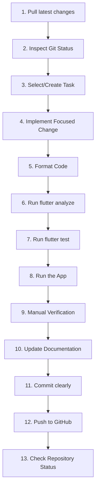

# Daily Development Guide - Lending Nelson

This guide outlines the standard daily developer workflow. Adherence ensures code remains clean, formatted, and verified.

---

## 🔄 The Development Cycle

Follow these 13 steps for every change:



### 1. Pull Latest Changes
Sync your local main branch before starting any task:
```powershell
git checkout main
git pull --rebase origin main
```

### 2. Inspect Git Status
Ensure your working directory is clean before building new logic:
```powershell
git status
```

### 3. Select or Create Task
Pick a task from [TODO.md](file:///d:/Development/lending_nelson/TODO.md) or your current milestone list. Mark it as in-progress `[/]`.

### 4. Implement Focused Change
Write code for one specific task. Avoid modifying unrelated widgets or utility files.

### 5. Format Code
Enforce Dart style guidelines:
```powershell
dart format lib test
```

### 6. Run Flutter Analyze
No commits are allowed if static analysis reports errors:
```powershell
flutter analyze
```

### 7. Run Flutter Test
Verify that changes do not break existing regressions:
```powershell
flutter test
```

### 8. Run the App
Launch the app in debug mode on your development target:
```powershell
flutter run
```

### 9. Perform Manual Verification
Walk through the UI flow step-by-step on the device or emulator to confirm correct layout and behavior.

### 10. Update Documentation
If you completed a roadmap phase, mark it complete in [ROADMAP.md](file:///d:/Development/lending_nelson/docs/planning/ROADMAP.md) and list the changes in `CHANGELOG.md`.

### 11. Commit with a Meaningful Message
Create small commits with descriptive messages following [GIT_WORKFLOW.md](file:///d:/Development/lending_nelson/docs/development/GIT_WORKFLOW.md) patterns.

### 12. Push to GitHub
```powershell
git push origin main
```

### 13. Review Repository Status
Ensure the remote build passes actions check and the repository state is clean.
