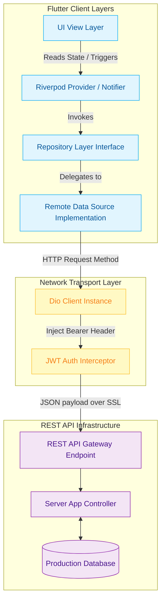

# API Architecture Flow

This diagram shows how data requests are structured, intercepted, and transmitted between the Flutter client and the database.

```mermaid
flowchart TD
    classDef client fill:#E1F5FE,stroke:#03A9F4,color:#01579B;
    classDef transport fill:#FFF9C4,stroke:#FBC02D,color:#F57F17;
    classDef server fill:#F3E5F5,stroke:#8E24AA,color:#4A148C;

    subgraph FlutterClient [Flutter Client Layers]
        UI[UI View Layer]:::client
        NOTIF[Riverpod Provider / Notifier]:::client
        REP[Repository Layer Interface]:::client
        RDS[Remote Data Source Implementation]:::client
        
        UI -->|Reads State / Triggers| NOTIF
        NOTIF -->|Invokes| REP
        REP -->|Delegates to| RDS
    end

    subgraph HttpTransport [Network Transport Layer]
        DIO[Dio Client Instance]:::transport
        INT[JWT Auth Interceptor]:::transport
        
        RDS -->|HTTP Request Method| DIO
        DIO -->|Inject Bearer Header| INT
    end

    subgraph BackendServer [REST API Infrastructure]
        R_API[REST API Gateway Endpoint]:::server
        B_APP[Server App Controller]:::server
        S_DB[(Production Database)]:::server
        
        INT -->|JSON payload over SSL| R_API
        R_API --> B_APP
        B_APP <--> S_DB
    end
```
