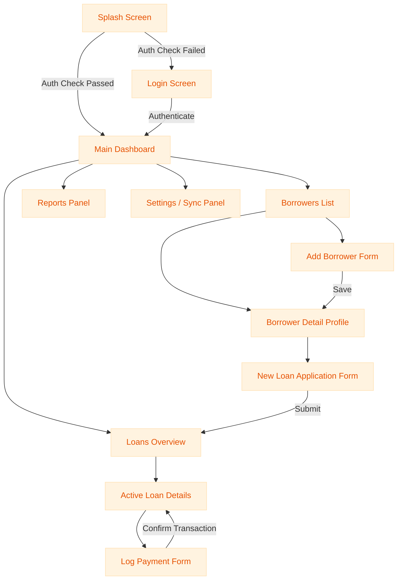

# Application User Flow

This diagram illustrates the navigation pathways for field staff interacting with the mobile client.

```mermaid
flowchart TD
    classDef screen fill:#FFF3E0,stroke:#FFE0B2,color:#E65100;
    classDef action fill:#E0F7FA,stroke:#B2EBF2,color:#006064;

    SPLASH[Splash Screen]:::screen
    LOGIN[Login Screen]:::screen
    DASH[Main Dashboard]:::screen
    BORR[Borrowers List]:::screen
    B_DETAIL[Borrower Detail Profile]:::screen
    B_ADD[Add Borrower Form]:::screen
    L_APP[New Loan Application Form]:::screen
    LOANS[Loans Overview]:::screen
    L_DETAIL[Active Loan Details]:::screen
    PAY[Log Payment Form]:::screen
    REP[Reports Panel]:::screen
    SET[Settings / Sync Panel]:::screen

    SPLASH -->|Auth Check Failed| LOGIN
    SPLASH -->|Auth Check Passed| DASH
    LOGIN -->|Authenticate| DASH
    
    DASH --> BORR
    DASH --> LOANS
    DASH --> REP
    DASH --> SET
    
    BORR --> B_DETAIL
    BORR --> B_ADD
    B_ADD -->|Save| B_DETAIL
    
    B_DETAIL --> L_APP
    L_APP -->|Submit| LOANS
    
    LOANS --> L_DETAIL
    L_DETAIL --> PAY
    PAY -->|Confirm Transaction| L_DETAIL
```
