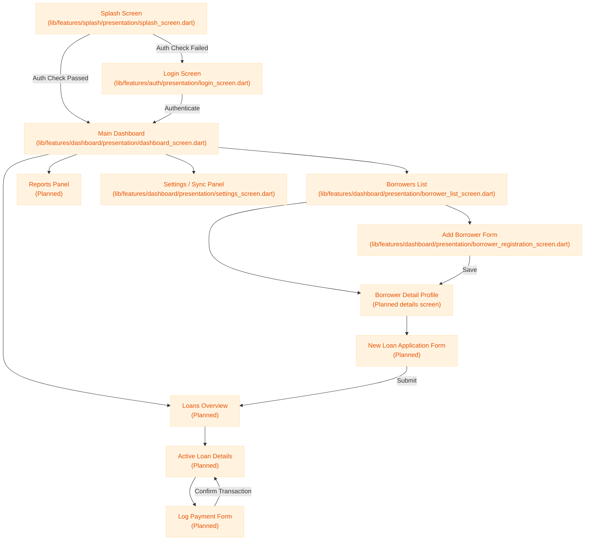

# Application User Flow

This diagram illustrates the navigation pathways for field staff interacting with the mobile client.

---

### File References

* **Splash Screen:** [splash_screen.dart](file:///d:/Development/lending_nelson/lib/features/splash/presentation/splash_screen.dart)
* **Login Screen:** [login_screen.dart](file:///d:/Development/lending_nelson/lib/features/auth/presentation/login_screen.dart)
* **Dashboard Screen:** [dashboard_screen.dart](file:///d:/Development/lending_nelson/lib/features/dashboard/presentation/dashboard_screen.dart)
* **Borrower List Screen:** [borrower_list_screen.dart](file:///d:/Development/lending_nelson/lib/features/dashboard/presentation/borrower_list_screen.dart)
* **Borrower Registration Screen:** [borrower_registration_screen.dart](file:///d:/Development/lending_nelson/lib/features/dashboard/presentation/borrower_registration_screen.dart)
* **Settings Screen:** [settings_screen.dart](file:///d:/Development/lending_nelson/lib/features/dashboard/presentation/settings_screen.dart)
* **Router Config:** [app_router.dart](file:///d:/Development/lending_nelson/lib/app/app_router.dart)
* **Theme Config:** [app_theme.dart](file:///d:/Development/lending_nelson/lib/app/app_theme.dart)
* **Database Cache:** [database_service.dart](file:///d:/Development/lending_nelson/lib/core/database/database_service.dart)

