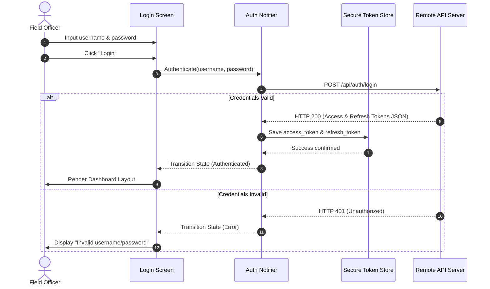

# Authentication Sequence Flow

This diagram illustrates the security verification sequence during user login and session capture.

```mermaid
sequenceDiagram
    autonumber
    actor User as Field Officer
    participant Screen as Login Screen
    participant Auth as Auth Notifier
    participant Sec as Secure Token Store
    participant API as Remote API Server

    User->>Screen: Input username & password
    User->>Screen: Click "Login"
    Screen->>Auth: Authenticate(username, password)
    Auth->>API: POST /api/auth/login
    alt Credentials Valid
        API-->>Auth: HTTP 200 (Access & Refresh Tokens JSON)
        Auth->>Sec: Save access_token & refresh_token
        Sec-->>Auth: Success confirmed
        Auth-->>Screen: Transition State (Authenticated)
        Screen->>User: Render Dashboard Layout
    else Credentials Invalid
        API-->>Auth: HTTP 401 (Unauthorized)
        Auth-->>Screen: Transition State (Error)
        Screen->>User: Display "Invalid username/password"
    end
```
