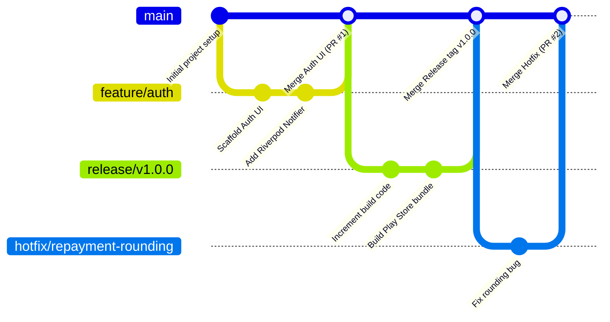

# Repository Branching Strategy (GitGraph)

This GitGraph illustrates the branching, integration, and hotfix workflows across branches.

```mermaid
gitGraph
    commit id: "Initial project setup"
    branch feature/auth
    checkout feature/auth
    commit id: "Scaffold Auth UI"
    commit id: "Add Riverpod Notifier"
    checkout main
    merge feature/auth id: "Merge Auth UI (PR #1)"
    
    branch release/v1.0.0
    checkout release/v1.0.0
    commit id: "Increment build code"
    commit id: "Build Play Store bundle"
    checkout main
    merge release/v1.0.0 id: "Merge Release tag v1.0.0"
    
    branch hotfix/repayment-rounding
    checkout hotfix/repayment-rounding
    commit id: "Fix rounding bug"
    checkout main
    merge hotfix/repayment-rounding id: "Merge Hotfix (PR #2)"
```
