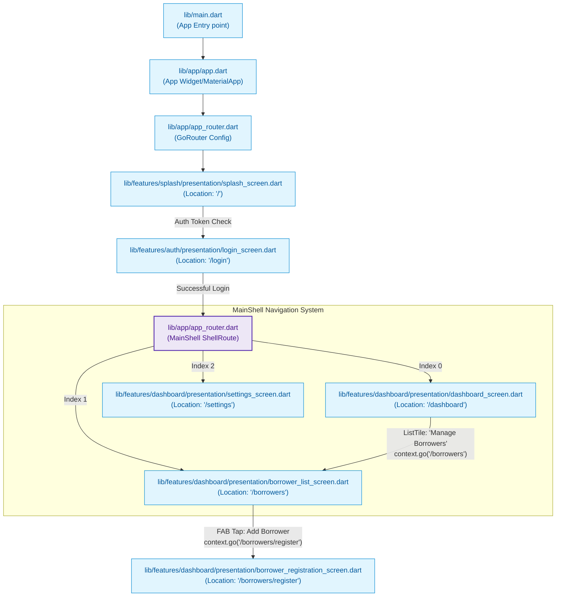

# Dashboard Screen Flow

This diagram illustrates the user navigation flow, route structure, and screen transitions centered around the Dashboard.

```mermaid
graph TD
    %% Main Entry Points
    main["lib/main.dart<br>(App Entry point)"] --> app["lib/app/app.dart<br>(App Widget/MaterialApp)"]
    app --> router["lib/app/app_router.dart<br>(GoRouter Config)"]
    
    %% Router Init Route
    router --> splash["lib/features/splash/presentation/splash_screen.dart<br>(Location: '/')"]
    
    %% Splash Logic
    splash -->|Auth Token Check| login["lib/features/auth/presentation/login_screen.dart<br>(Location: '/login')"]
    
    %% Login Logic
    login -->|Successful Login| mainShell["lib/app/app_router.dart<br>(MainShell ShellRoute)"]
    
    %% Shell Routes
    subgraph MainShellContainer [MainShell Navigation System]
        mainShell -->|Index 0| dashboard["lib/features/dashboard/presentation/dashboard_screen.dart<br>(Location: '/dashboard')"]
        mainShell -->|Index 1| borrowers["lib/features/dashboard/presentation/borrower_list_screen.dart<br>(Location: '/borrowers')"]
        mainShell -->|Index 2| settings["lib/features/dashboard/presentation/settings_screen.dart<br>(Location: '/settings')"]
    end
    
    %% Navigation Transitions within Dashboard Screen
    dashboard -- "ListTile: 'Manage Borrowers'<br>context.go('/borrowers')" --> borrowers
    
    %% Registration Transition
    borrowers -- "FAB Tap: Add Borrower<br>context.go('/borrowers/register')" --> register["lib/features/dashboard/presentation/borrower_registration_screen.dart<br>(Location: '/borrowers/register')"]
    
    %% Styling
    classDef fileNode fill:#e1f5fe,stroke:#0288d1,stroke-width:1px,color:#01579b;
    classDef shellNode fill:#ede7f6,stroke:#5e35b1,stroke-width:2px,color:#4a148c;
    class main,app,router,splash,login,dashboard,borrowers,register,settings fileNode;
    class mainShell shellNode;
```
