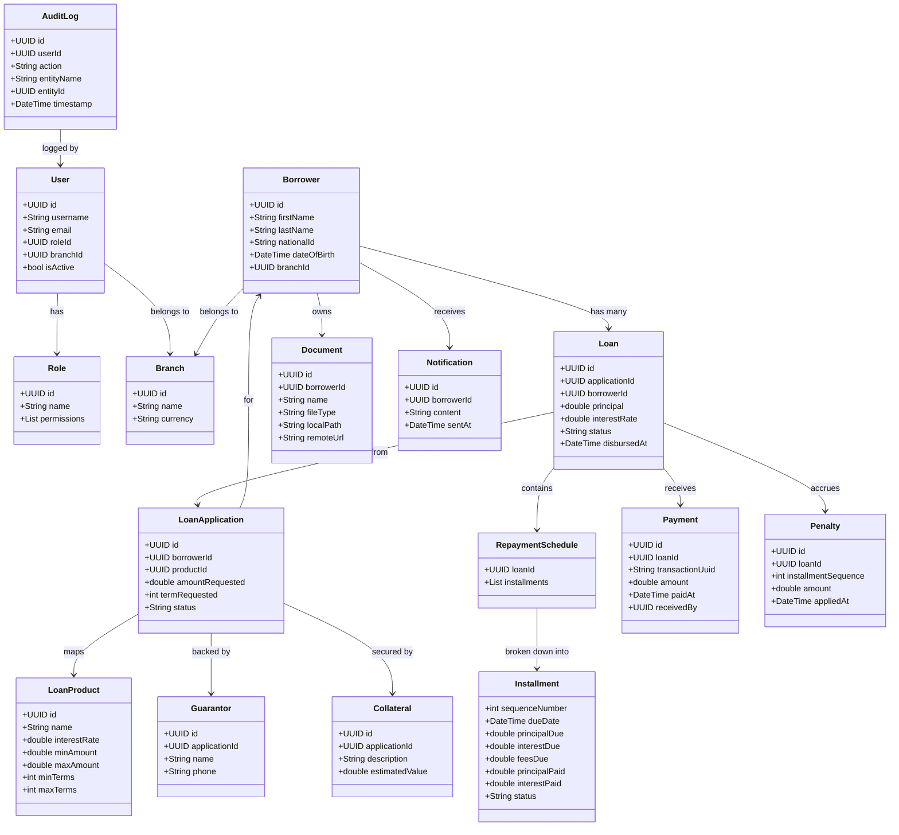

# Entity Domain Class Diagram

This diagram displays the database entities, fields, and relationships defined in the domain layer specifications.

```mermaid
classDiagram
    class User {
        +UUID id
        +String username
        +String email
        +UUID roleId
        +UUID branchId
        +bool isActive
    }

    class Role {
        +UUID id
        +String name
        +List permissions
    }

    class Branch {
        +UUID id
        +String name
        +String currency
    }

    class Borrower {
        +UUID id
        +String firstName
        +String lastName
        +String nationalId
        +DateTime dateOfBirth
        +UUID branchId
    }

    class LoanProduct {
        +UUID id
        +String name
        +double interestRate
        +double minAmount
        +double maxAmount
        +int minTerms
        +int maxTerms
    }

    class LoanApplication {
        +UUID id
        +UUID borrowerId
        +UUID productId
        +double amountRequested
        +int termRequested
        +String status
    }

    class Loan {
        +UUID id
        +UUID applicationId
        +UUID borrowerId
        +double principal
        +double interestRate
        +String status
        +DateTime disbursedAt
    }

    class RepaymentSchedule {
        +UUID loanId
        +List installments
    }

    class Installment {
        +int sequenceNumber
        +DateTime dueDate
        +double principalDue
        +double interestDue
        +double feesDue
        +double principalPaid
        +double interestPaid
        +String status
    }

    class Payment {
        +UUID id
        +UUID loanId
        +String transactionUuid
        +double amount
        +DateTime paidAt
        +UUID receivedBy
    }

    class Penalty {
        +UUID id
        +UUID loanId
        +int installmentSequence
        +double amount
        +DateTime appliedAt
    }

    class Guarantor {
        +UUID id
        +UUID applicationId
        +String name
        +String phone
    }

    class Collateral {
        +UUID id
        +UUID applicationId
        +String description
        +double estimatedValue
    }

    class Document {
        +UUID id
        +UUID borrowerId
        +String name
        +String fileType
        +String localPath
        +String remoteUrl
    }

    class AuditLog {
        +UUID id
        +UUID userId
        +String action
        +String entityName
        +UUID entityId
        +DateTime timestamp
    }

    class Notification {
        +UUID id
        +UUID borrowerId
        +String content
        +DateTime sentAt
    }

    User --> Role : has
    User --> Branch : belongs to
    Borrower --> Branch : belongs to
    Borrower --> Document : owns
    Borrower --> Loan : has many
    Borrower --> Notification : receives
    LoanApplication --> Borrower : for
    LoanApplication --> LoanProduct : maps
    LoanApplication --> Guarantor : backed by
    LoanApplication --> Collateral : secured by
    Loan --> LoanApplication : created from
    Loan --> RepaymentSchedule : contains
    RepaymentSchedule --> Installment : broken down into
    Loan --> Payment : receives
    Loan --> Penalty : accrues
    AuditLog --> User : logged by
```
