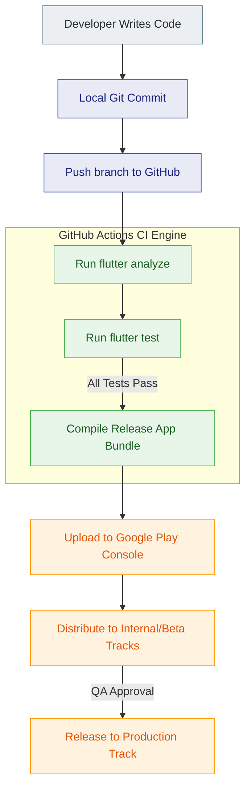

# Deployment Lifecycle Flow

This diagram details the path code changes travel, from local commit edits to publishing on the Google Play Store.

```mermaid
flowchart TD
    classDef dev fill:#ECEFF1,stroke:#607D8B,color:#263238;
    classDef git fill:#E8EAF6,stroke:#3F51B5,color:#1A237E;
    classDef pipeline fill:#E8F5E9,stroke:#4CAF50,color:#1B5E20;
    classDef store fill:#FFF3E0,stroke:#FF9800,color:#E65100;

    DEV[Developer Writes Code]:::dev
    COMMIT[Local Git Commit]:::git
    PUSH[Push branch to GitHub]:::git
    
    subgraph CI_Pipeline [GitHub Actions CI Engine]
        LINT[Run flutter analyze]:::pipeline
        TEST[Run flutter test]:::pipeline
        BUILD[Compile Release App Bundle]:::pipeline
    end

    SUBMIT[Upload to Google Play Console]:::store
    TRACK[Distribute to Internal/Beta Tracks]:::store
    LIVE[Release to Production Track]:::store

    DEV --> COMMIT
    COMMIT --> PUSH
    PUSH --> LINT
    LINT --> TEST
    TEST -->|All Tests Pass| BUILD
    BUILD --> SUBMIT
    SUBMIT --> TRACK
    TRACK -->|QA Approval| LIVE
```
