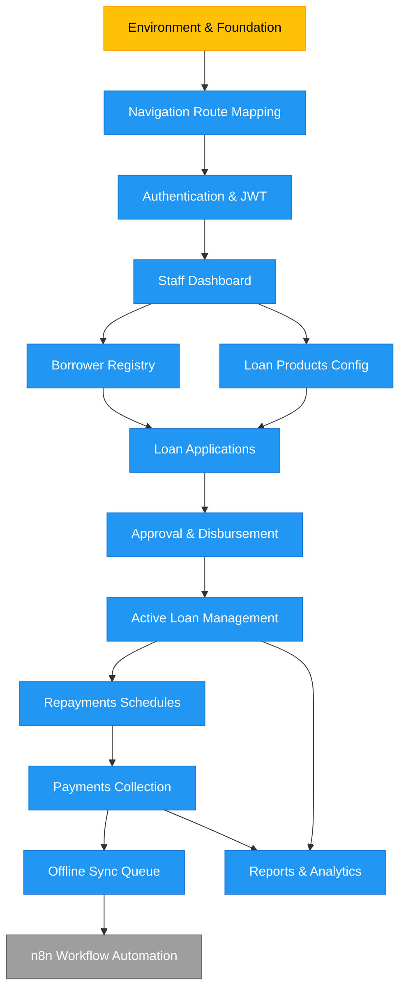

# Feature Dependencies Tree

This diagram illustrates how core application capabilities depend on earlier foundational modules.

```mermaid
flowchart TD
    classDef completed fill:#4CAF50,stroke:#388E3C,color:#fff;
    classDef inprogress fill:#FFC107,stroke:#FFA000,color:#000;
    classDef planned fill:#2196F3,stroke:#1976D2,color:#fff;
    classDef future fill:#9E9E9E,stroke:#616161,color:#fff;

    ENV[Environment & Foundation]:::inprogress
    NAV[Navigation Route Mapping]:::planned
    AUTH[Authentication & JWT]:::planned
    DASH[Staff Dashboard]:::planned
    BORR[Borrower Registry]:::planned
    PROD[Loan Products Config]:::planned
    APP[Loan Applications]:::planned
    DISB[Approval & Disbursement]:::planned
    LOAN[Active Loan Management]:::planned
    REPAY[Repayments Schedules]:::planned
    PAY[Payments Collection]:::planned
    SYNC[Offline Sync Queue]:::planned
    REP[Reports & Analytics]:::planned
    N8N[n8n Workflow Automation]:::future

    ENV --> NAV
    NAV --> AUTH
    AUTH --> DASH
    DASH --> BORR
    DASH --> PROD
    BORR --> APP
    PROD --> APP
    APP --> DISB
    DISB --> LOAN
    LOAN --> REPAY
    REPAY --> PAY
    PAY --> SYNC
    LOAN --> REP
    PAY --> REP
    SYNC --> N8N
```
