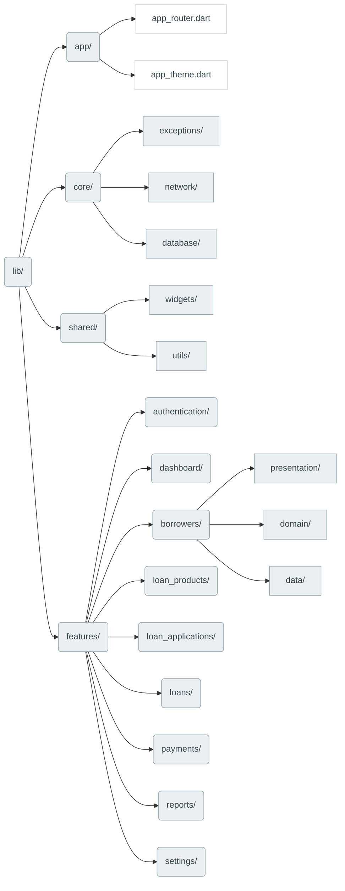

# Propose Directory Structure Diagram

This diagram maps the future modular feature-first layout for the Flutter codebase (`lib/`).

```mermaid
flowchart LR
    classDef dir fill:#ECEFF1,stroke:#90A4AE,color:#37474F;
    classDef file fill:#fff,stroke:#CFD8DC,color:#37474F;

    ROOT(lib/):::dir
    APP(app/):::dir
    CORE(core/):::dir
    SHARED(shared/):::dir
    FEAT(features/):::dir

    ROOT --> APP
    ROOT --> CORE
    ROOT --> SHARED
    ROOT --> FEAT

    APP --> APPF1[app_router.dart]:::file
    APP --> APPF2[app_theme.dart]:::file

    CORE --> COREF1[exceptions/]:::dir
    CORE --> COREF2[network/]:::dir
    CORE --> COREF3[database/]:::dir

    SHARED --> SHAREDF1[widgets/]:::dir
    SHARED --> SHAREDF2[utils/]:::dir

    FEAT --> F_AUTH(authentication/):::dir
    FEAT --> F_DASH(dashboard/):::dir
    FEAT --> F_BORR(borrowers/):::dir
    FEAT --> F_PROD(loan_products/):::dir
    FEAT --> F_APPS(loan_applications/):::dir
    FEAT --> F_LOAN(loans/):::dir
    FEAT --> F_PMT(payments/):::dir
    FEAT --> F_REP(reports/):::dir
    FEAT --> F_SET(settings/):::dir

    F_BORR --> F_BORR_P[presentation/]:::dir
    F_BORR --> F_BORR_D[domain/]:::dir
    F_BORR --> F_BORR_DT[data/]:::dir
```
