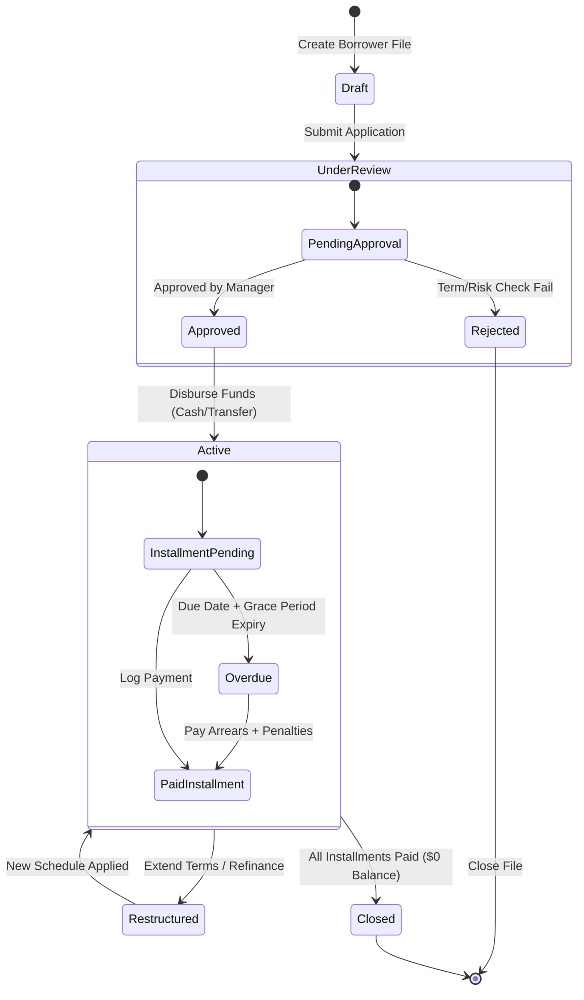

# Loan Contract Lifecycle States

This diagram shows the states a loan transitions through, from initial drafting to settlement or delinquency collection.

```mermaid
stateDiagram-v2
    [*] --> Draft : Create Borrower File
    Draft --> UnderReview : Submit Application
    
    state UnderReview {
        [*] --> PendingApproval
        PendingApproval --> Rejected : Term/Risk Check Fail
        PendingApproval --> Approved : Approved by Manager
    }

    Rejected --> [*] : Close File
    Approved --> Active : Disburse Funds (Cash/Transfer)
    
    state Active {
        [*] --> InstallmentPending
        InstallmentPending --> PaidInstallment : Log Payment
        InstallmentPending --> Overdue : Due Date + Grace Period Expiry
        Overdue --> PaidInstallment : Pay Arrears + Penalties
    }

    Active --> Restructured : Extend Terms / Refinance
    Restructured --> Active : New Schedule Applied

    Active --> Closed : All Installments Paid ($0 Balance)
    Closed --> [*]
```
