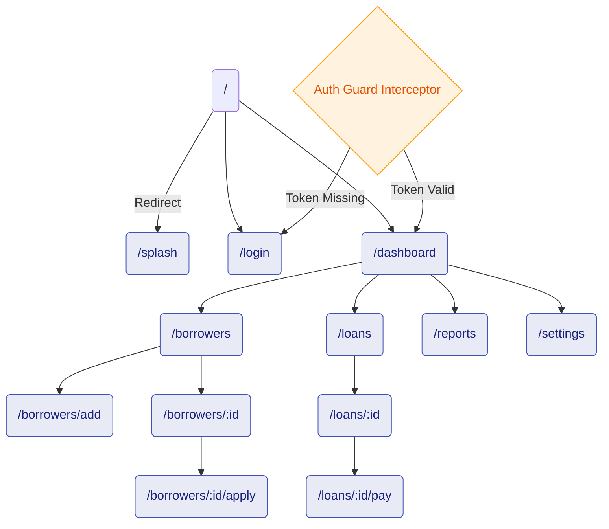

# Navigation Routing Map (GoRouter)

This diagram details the declarative route definitions and redirection logic configured in GoRouter.

```mermaid
flowchart TD
    classDef route fill:#E8EAF6,stroke:#3F51B5,color:#1A237E;
    classDef guard fill:#FFF3E0,stroke:#FF9800,color:#E65100;

    ROOT(/) -->|Redirect| SPLASH(/splash):::route
    ROOT --> LOGIN(/login):::route
    ROOT --> DASH(/dashboard):::route

    GUARD{Auth Guard Interceptor}:::guard
    GUARD -->|Token Missing| LOGIN
    GUARD -->|Token Valid| DASH

    DASH --> BORR(/borrowers):::route
    BORR --> B_ADD(/borrowers/add):::route
    BORR --> B_DET(/borrowers/:id):::route
    B_DET --> L_APP(/borrowers/:id/apply):::route

    DASH --> LOANS(/loans):::route
    LOANS --> L_DET(/loans/:id):::route
    L_DET --> PAY(/loans/:id/pay):::route

    DASH --> REP(/reports):::route
    DASH --> SET(/settings):::route
```
