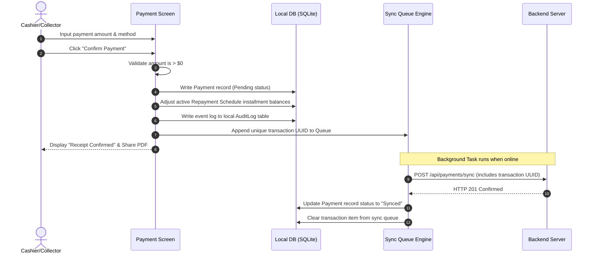

# Payment Collection Sequence

This sequence diagram details the steps required to record a payment, adjust schedules, and queue synchronization actions.

```mermaid
sequenceDiagram
    autonumber
    actor Cashier as Cashier/Collector
    participant UI as Payment Screen
    participant DB as Local DB (SQLite)
    participant Sync as Sync Queue Engine
    participant API as Backend Server

    Cashier->>UI: Input payment amount & method
    Cashier->>UI: Click "Confirm Payment"
    UI->>UI: Validate amount is > $0
    
    UI->>DB: Write Payment record (Pending status)
    UI->>DB: Adjust active Repayment Schedule installment balances
    UI->>DB: Write event log to local AuditLog table
    
    UI->>Sync: Append unique transaction UUID to Queue
    UI-->>Cashier: Display "Receipt Confirmed" & Share PDF
    
    Note over Sync, API: Background Task runs when online
    Sync->>API: POST /api/payments/sync (includes transaction UUID)
    API-->>Sync: HTTP 201 Confirmed
    Sync->>DB: Update Payment record status to "Synced"
    Sync->>DB: Clear transaction item from sync queue
```
