# Master Project Flow Diagram

This diagram displays the end-to-end project lifecycle for the `lending-nelson` Flutter application, categorizing phases by their implementation status.

```mermaid
flowchart TD
    classDef completed fill:#4CAF50,stroke:#388E3C,color:#fff;
    classDef inprogress fill:#FFC107,stroke:#FFA000,color:#000;
    classDef planned fill:#2196F3,stroke:#1976D2,color:#fff;
    classDef future fill:#9E9E9E,stroke:#616161,color:#fff;

    P0[Phase 0: Env Setup]:::completed
    P1[Phase 1: Docs & Blueprint]:::completed
    P2[Phase 2: Flutter Foundation]:::inprogress
    P3[Phase 3: Design & Navigation]:::planned
    P4[Phase 4: Auth & Authz]:::planned
    P5[Phase 5: Borrower Management]:::planned
    P6[Phase 6: Loan Products]:::planned
    P7[Phase 7: Loan Applications]:::planned
    P8[Phase 8: Approval & Disbursement]:::planned
    P9[Phase 9: Repayments Schedules]:::planned
    P10[Phase 10: Payments & Receipts]:::planned
    P11[Phase 11: Penalties & Collections]:::planned
    P12[Phase 12: Docs & Notifications]:::planned
    P13[Phase 13: Offline Sync Engine]:::planned
    P14[Phase 14: Reports & Analytics]:::planned
    P15[Phase 15: Web Admin Panel]:::future
    P16[Phase 16: n8n Integration]:::future
    P17[Phase 17: Security Hardening]:::future
    P18[Phase 18: QA Testing]:::future
    P19[Phase 19: Release Prep]:::future
    P20[Phase 20: Prod Deployment]:::future

    P0 --> P1 --> P2 --> P3 --> P4 --> P5 --> P6 --> P7 --> P8 --> P9 --> P10 --> P11 --> P12 --> P13 --> P14 --> P15 --> P16 --> P17 --> P18 --> P19 --> P20
```

## Status Legend
* **Completed:** Phase 0 & Phase 1
* **In Progress:** Phase 2
* **Planned:** Phase 3 to Phase 14
* **Future:** Phase 15 to Phase 20
