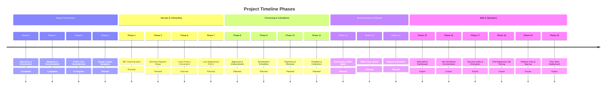

# Project Phased Timeline

This timeline map highlights the 21 phases (0 to 20) planned for the `lending-nelson` project.

```mermaid
timeline
    title Project Timeline Phases
    section Setup & Architecture
        Phase 0 : Repository & Environment : Completed
        Phase 1 : Blueprints & Documentation : Completed
        Phase 2 : Flutter Core Dependencies : In Progress
        Phase 3 : Design & Base Navigation : Planned
    section Security & Onboarding
        Phase 4 : JWT Authentication : Planned
        Phase 5 : Borrower Registry Setup : Planned
        Phase 6 : Loan Product Constraints : Planned
        Phase 7 : Loan Applications Forms : Planned
    section Processing & Calculations
        Phase 8 : Approvals & Disbursement : Planned
        Phase 9 : Amortization Schedules : Planned
        Phase 10 : Payments & Receipts : Planned
        Phase 11 : Penalties & Collections : Planned
    section Synchronization & Reports
        Phase 12 : Documents & SMS Alerts : Planned
        Phase 13 : Offline Sync Queue : Planned
        Phase 14 : Reports & Analytics : Planned
    section Web & Operations
        Phase 15 : Web Admin Dashboard : Future
        Phase 16 : n8n Workflows Orchestration : Future
        Phase 17 : Security Audits & Encryption : Future
        Phase 18 : Full Regression QA Testing : Future
        Phase 19 : Release Prep & Signing : Future
        Phase 20 : Play Store Deployment : Future
```
