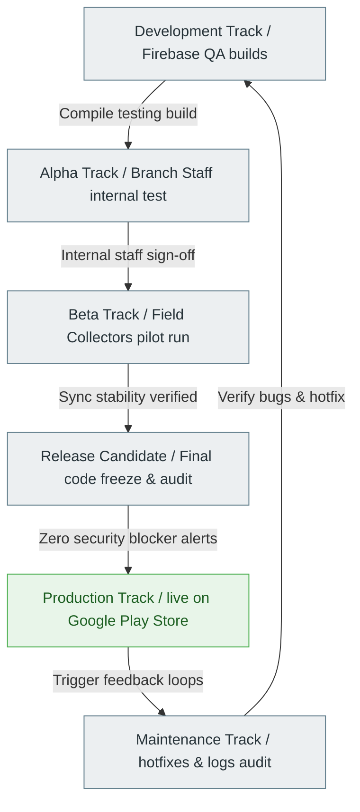

# Application Release Lifecycle

This diagram details the release progression from development commits to app store production updates.

```mermaid
flowchart TD
    classDef stage fill:#ECEFF1,stroke:#607D8B,color:#263238;
    classDef active fill:#E8F5E9,stroke:#4CAF50,color:#1B5E20;

    DEV[Development Track / Firebase QA builds]:::stage
    ALPHA[Alpha Track / Branch Staff internal test]:::stage
    BETA[Beta Track / Field Collectors pilot run]:::stage
    RC[Release Candidate / Final code freeze & audit]:::stage
    PROD[Production Track / live on Google Play Store]:::active
    MAINT[Maintenance Track / hotfixes & logs audit]:::stage

    DEV -->|Compile testing build| ALPHA
    ALPHA -->|Internal staff sign-off| BETA
    BETA -->|Sync stability verified| RC
    RC -->|Zero security blocker alerts| PROD
    PROD -->|Trigger feedback loops| MAINT
    MAINT -->|Verify bugs & hotfix| DEV
```
