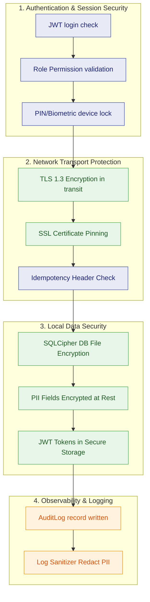

# Application Security Layers

This diagram maps the validation and protection checkpoints that secure user sessions and borrower information.

```mermaid
flowchart TD
    classDef auth fill:#E8EAF6,stroke:#3F51B5,color:#1A237E;
    classDef enc fill:#E8F5E9,stroke:#4CAF50,color:#1B5E20;
    classDef alert fill:#FFF3E0,stroke:#FF9800,color:#E65100;

    subgraph Access [1. Authentication & Session Security]
        AUTH[JWT login check]:::auth
        ROLE[Role Permission validation]:::auth
        LOCK[PIN/Biometric device lock]:::auth
    end

    subgraph Net [2. Network Transport Protection]
        TLS[TLS 1.3 Encryption in transit]:::enc
        PIN[SSL Certificate Pinning]:::enc
        IDEM[Idempotency Header Check]:::auth
    end

    subgraph DataSec [3. Local Data Security]
        SQLC[SQLCipher DB File Encryption]:::enc
        PII[PII Fields Encrypted at Rest]:::enc
        STR[JWT Tokens in Secure Storage]:::enc
    end

    subgraph Auditing [4. Observability & Logging]
        AUD[AuditLog record written]:::alert
        RED[Log Sanitizer Redact PII]:::alert
    end

    AUTH --> ROLE --> LOCK
    LOCK --> TLS --> PIN --> IDEM
    IDEM --> SQLC --> PII --> STR
    STR --> AUD --> RED
```
