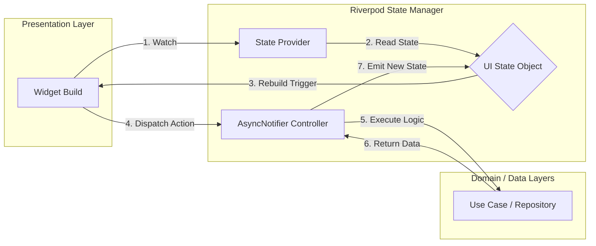

# Client State Management Flow (Riverpod)

This diagram details the reactive state cycle using Riverpod Notifiers within UI screens.

```mermaid
flowchart LR
    subgraph View [Presentation Layer]
        WDG[Widget Build]
    end

    subgraph State [Riverpod State Manager]
        PROV[State Provider]
        NOTIF[AsyncNotifier Controller]
        DATA{UI State Object}
    end

    subgraph Business [Domain / Data Layers]
        UC[Use Case / Repository]
    end

    WDG -->|1. Watch| PROV
    PROV -->|2. Read State| DATA
    DATA -->|3. Rebuild Trigger| WDG
    
    WDG -->|4. Dispatch Action| NOTIF
    NOTIF -->|5. Execute Logic| UC
    UC -->|6. Return Data| NOTIF
    NOTIF -->|7. Emit New State| DATA
```
