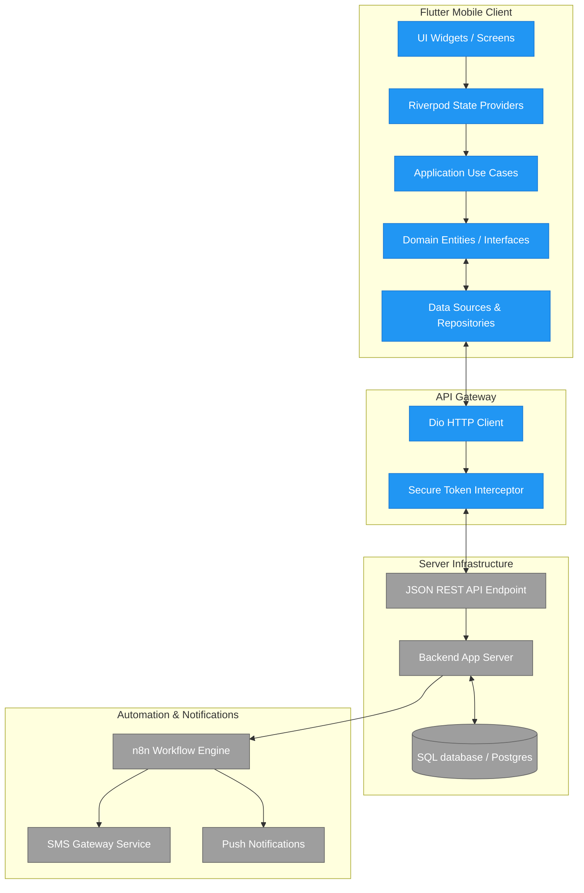

# System Architecture Overview

This diagram displays the layered Clean Architecture layers from the Flutter UI components to backend storage and external automation services.

## Architectural Status
* **Client Core Layers:** Planned (implemented during Phases 2-3)
* **Transport (Dio):** Planned (implemented during Phase 2)
* **Backend Storage & API:** Future (undecided technology)
* **External Integrations:** Future (n8n workflows)
