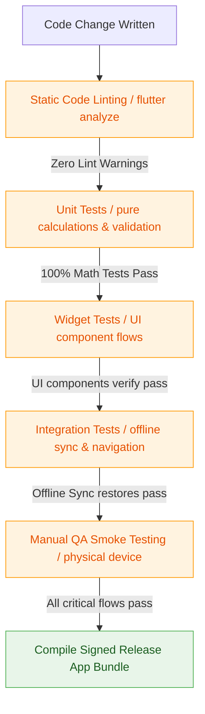

# Quality Control & Testing Pipeline

This diagram outlines the testing gates a code change must pass before reaching production.

```mermaid
flowchart TD
    classDef gate fill:#FFF3E0,stroke:#FF9800,color:#E65100;
    classDef pass fill:#E8F5E9,stroke:#4CAF50,color:#1B5E20;

    CODE[Code Change Written]
    LINT[Static Code Linting / flutter analyze]:::gate
    UNIT[Unit Tests / pure calculations & validation]:::gate
    WDG[Widget Tests / UI component flows]:::gate
    INT[Integration Tests / offline sync & navigation]:::gate
    MAN[Manual QA Smoke Testing / physical device]:::gate
    REL[Compile Signed Release App Bundle]:::pass

    CODE --> LINT
    LINT -->|Zero Lint Warnings| UNIT
    UNIT -->|100% Math Tests Pass| WDG
    WDG -->|UI components verify pass| INT
    INT -->|Offline Sync restores pass| MAN
    MAN -->|All critical flows pass| REL
```
