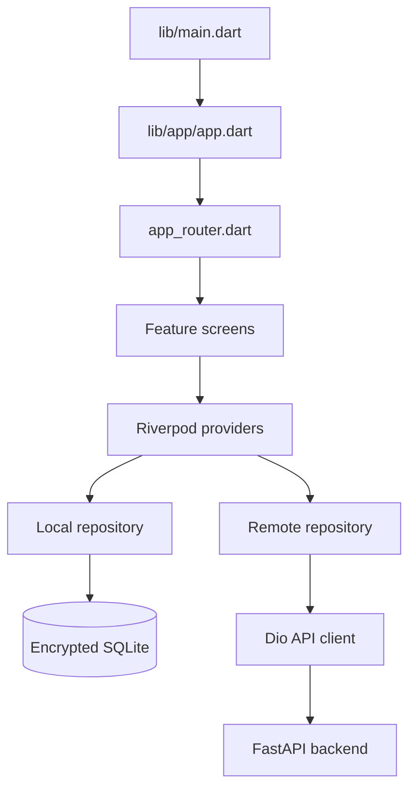
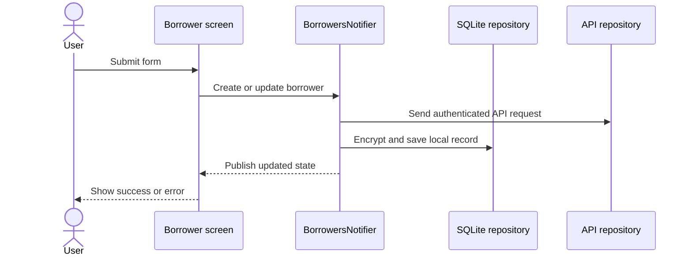
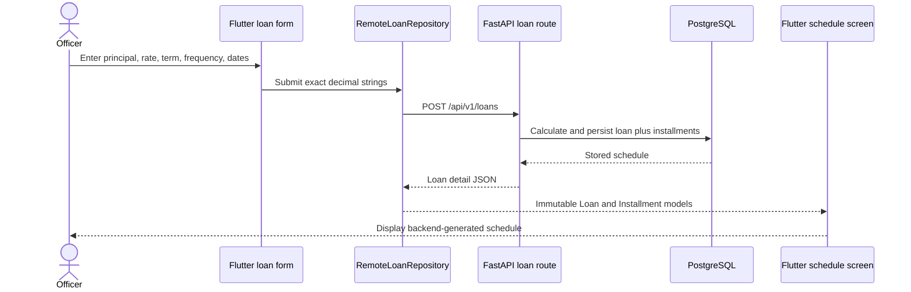
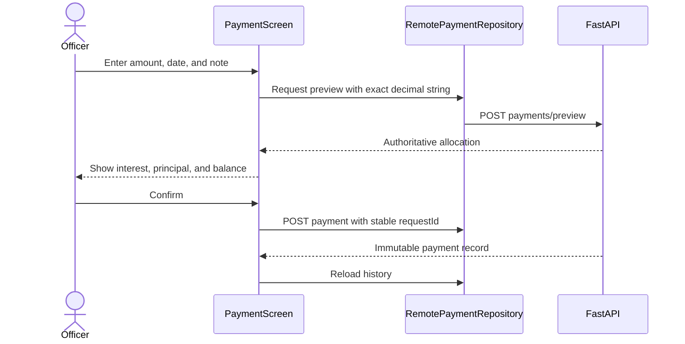

# Flutter Frontend Study Guide

This path teaches the mobile side of Lending Nelson. The Flutter application
displays the interface, manages state, stores encrypted offline data, and calls
the FastAPI backend.

## Learning goals

By the end of this path, you should understand how to:

- build forms and responsive screens with Flutter;
- navigate with GoRouter;
- manage asynchronous state with Riverpod;
- separate presentation, domain, and data code;
- store encrypted borrower data in SQLite;
- call authenticated APIs with Dio;
- create loans and display backend-generated installment schedules; and
- queue changes when the device is offline.

## Frontend map



| Folder | What to study |
| --- | --- |
| `lib/app/` | App root, routes, light theme, and dark theme |
| `lib/core/database/` | SQLite schema and database lifecycle |
| `lib/core/network/` | API address, tokens, errors, and offline queue |
| `lib/core/security/` | Encryption of local borrower information |
| `lib/features/auth/` | Login UI and authentication repository |
| `lib/features/dashboard/` | Dashboard and borrower CRUD feature |
| `lib/features/loans/` | Loan models, API repository, Riverpod state, form, and schedule UI |
| `test/` | Unit and widget test examples |

## Recommended reading order

1. `lib/main.dart`
2. `lib/app/app.dart`
3. `lib/app/app_router.dart`
4. `lib/features/auth/presentation/login_screen.dart`
5. `lib/features/auth/data/auth_repository.dart`
6. `lib/features/dashboard/domain/models/borrower.dart`
7. `lib/features/dashboard/presentation/borrower_list_screen.dart`
8. `lib/features/dashboard/presentation/providers/borrowers_provider.dart`
9. `lib/features/dashboard/data/repositories/borrower_repository.dart`
10. `lib/features/dashboard/data/repositories/remote_borrower_repository.dart`
11. `lib/features/loans/domain/models/loan.dart`
12. `lib/features/loans/data/repositories/remote_loan_repository.dart`
13. `lib/features/loans/presentation/loan_create_screen.dart`
14. `lib/features/loans/presentation/loan_detail_screen.dart`
15. `lib/features/loans/domain/models/payment.dart`
16. `lib/features/loans/data/repositories/remote_payment_repository.dart`
17. `lib/features/loans/presentation/payment_screen.dart`

## Borrower feature flow



## Loan feature flow



Flutter never calculates the authoritative installment amounts. It validates
input, sends exact terms, and displays the schedule returned by FastAPI.

For safe retries, the form generates one UUID `requestId` for a valid set of
terms. A timeout or unchanged retry reuses it, while editing any term generates
a new UUID. The submit button is disabled while a request is pending. These UI
guards improve feedback, while PostgreSQL remains the final duplicate barrier.

## Payment feature flow



Flutter validates input and displays results but does not calculate the
financial allocation. A successful payment clears its retry UUID before the
next collection.

For corrections, only the latest eligible payment shows `Reverse Payment`.
The officer enters a required reason and confirms the reversal date. Flutter
sends a stable retry UUID, then refreshes the loan and history. The original is
labelled `Reversed`, while the linked entry is labelled `Reversal`; neither is
removed from the screen.

## Run and verify

From the project root:

```powershell
flutter pub get
flutter run --dart-define=API_BASE_URL=http://10.0.2.2:8000
```

Before committing frontend changes:

```powershell
dart format lib test
flutter analyze
flutter test
```

## Frontend exercises

1. Add validation for a new borrower field.
2. Add a loading indicator to an API action.
3. Write a widget test for an error message.
4. Add filtering to the borrower list using Riverpod state.
5. Design a visible offline-sync status indicator.

Continue with the shared [Visual Flow](../VISUAL_FLOW.md) or switch to the
[Backend Study Guide](../backend/README.md).
