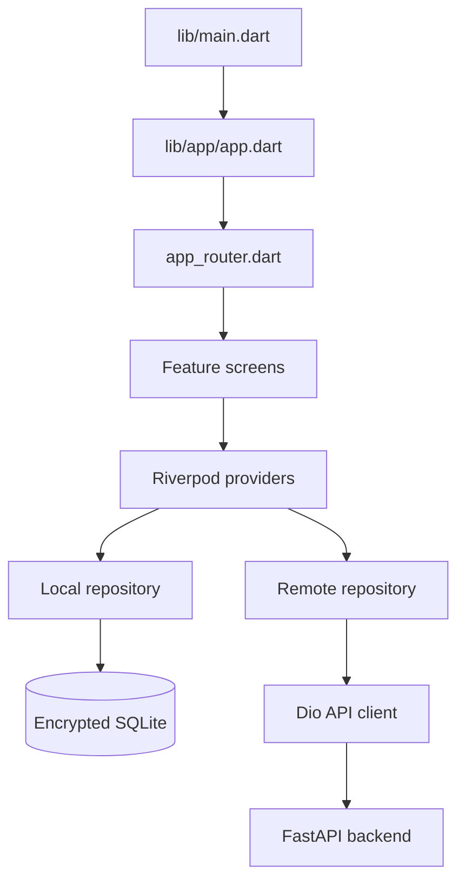
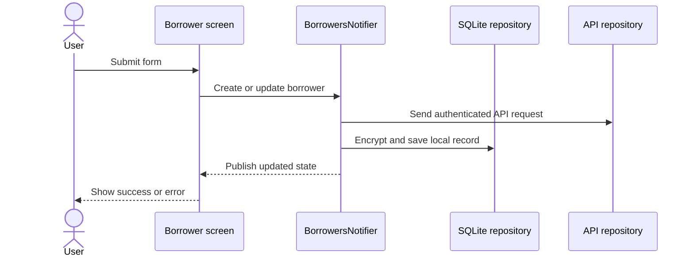

# Flutter Frontend Study Guide

This path teaches the mobile side of Lending Nelson. The Flutter application
displays the interface, manages state, stores encrypted offline data, and calls
the FastAPI backend.

## Learning goals

By the end of this path, you should understand how to:

- build forms and responsive screens with Flutter;
- navigate with GoRouter;
- manage asynchronous state with Riverpod;
- separate presentation, domain, and data code;
- store encrypted borrower data in SQLite;
- call authenticated APIs with Dio; and
- queue changes when the device is offline.

## Frontend map



| Folder | What to study |
| --- | --- |
| `lib/app/` | App root, routes, light theme, and dark theme |
| `lib/core/database/` | SQLite schema and database lifecycle |
| `lib/core/network/` | API address, tokens, errors, and offline queue |
| `lib/core/security/` | Encryption of local borrower information |
| `lib/features/auth/` | Login UI and authentication repository |
| `lib/features/dashboard/` | Dashboard and borrower CRUD feature |
| `test/` | Unit and widget test examples |

## Recommended reading order

1. `lib/main.dart`
2. `lib/app/app.dart`
3. `lib/app/app_router.dart`
4. `lib/features/auth/presentation/login_screen.dart`
5. `lib/features/auth/data/auth_repository.dart`
6. `lib/features/dashboard/domain/models/borrower.dart`
7. `lib/features/dashboard/presentation/borrower_list_screen.dart`
8. `lib/features/dashboard/presentation/providers/borrowers_provider.dart`
9. `lib/features/dashboard/data/repositories/borrower_repository.dart`
10. `lib/features/dashboard/data/repositories/remote_borrower_repository.dart`

## Borrower feature flow



## Run and verify

From the project root:

```powershell
flutter pub get
flutter run --dart-define=API_BASE_URL=http://10.0.2.2:8000
```

Before committing frontend changes:

```powershell
dart format lib test
flutter analyze
flutter test
```

## Frontend exercises

1. Add validation for a new borrower field.
2. Add a loading indicator to an API action.
3. Write a widget test for an error message.
4. Add filtering to the borrower list using Riverpod state.
5. Design a visible offline-sync status indicator.

Continue with the shared [Visual Flow](../VISUAL_FLOW.md) or switch to the
[Backend Study Guide](../backend/README.md).
