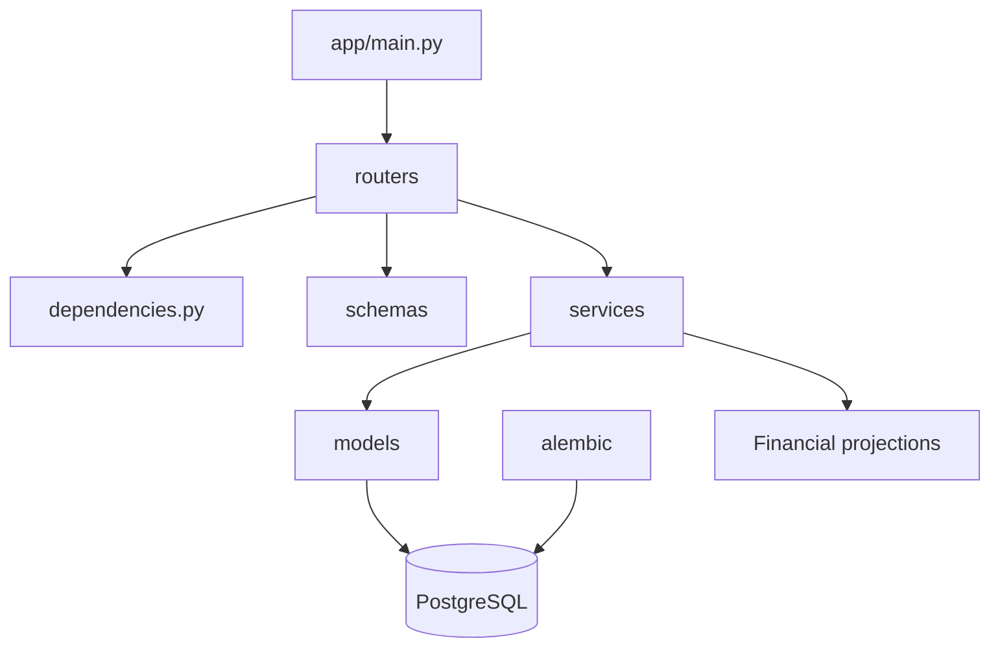
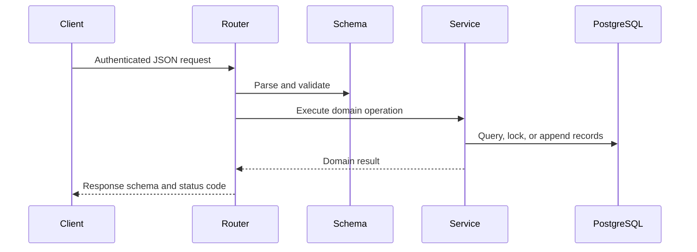

# FastAPI Backend Study Guide

The backend authenticates users, validates API contracts, applies loan and payment rules, persists immutable financial history, and generates Flutter-ready projections.

For installation and commands, use [backend/README.md](../../backend/README.md). This document focuses on architecture and code-reading order.

## Backend map

| Location | Responsibility |
| --- | --- |
| `app/main.py` | Application creation, CORS, router registration, health endpoint |
| `app/config.py` | Environment-backed settings |
| `app/database.py` | Async engine and session factory |
| `app/dependencies.py` | Database and authenticated-user dependencies |
| `app/routers/` | Thin HTTP handlers |
| `app/schemas/` | Pydantic request and response contracts |
| `app/services/` | Domain rules, calculations, reconciliation, and projections |
| `app/models/` | SQLAlchemy mappings |
| `alembic/` | Versioned PostgreSQL schema changes |
| `tests/` | Unit, API-contract, and optional PostgreSQL integration tests |

## Recommended reading order

1. `app/main.py`, `config.py`, `database.py`, and `dependencies.py`
2. Authentication router, schemas, and service
3. Borrower router, schemas, model, and service
4. Loan calculator and loan service
5. Loan router, workflow service, and lifecycle models
6. Payment calculator, service, ledger models, and reversal flow
7. Projection schemas and services
8. Offline-sync schemas, router, and dispatcher
9. Alembic revisions
10. Tests matching each area

## Financial service principles

- Quantize currency using exact `Decimal` arithmetic.
- Allocate payments using the configured service rule, not client-provided totals.
- Persist request IDs under uniqueness constraints for safe replay.
- Lock financial rows when confirming or reversing payments.
- Append reversal entries rather than deleting or editing completed payments.
- Derive receipts, statements, dashboard metrics, and reports from persisted data.
- Keep response serialization in schemas and business calculations in services.

## Request lifecycle

## Current capability areas

- Access and refresh authentication
- Borrower CRUD and soft deletion
- Active and draft loan creation
- Loan workflow transitions and lifecycle timestamps
- Stable loan and payment pagination
- Payment preview, confirmation, idempotency, and reversals
- Receipt and loan-statement projections
- Dashboard and financial-report projections
- Offline borrower, loan, payment, and reversal dispatch
- Development-only reset and seed helpers

## Verification

Last verified results are recorded in [backend/README.md](../../backend/README.md): 63 backend tests executed with 60 passed, 3 skipped, and no failures. The complete Postman suite executes 68 requests and 124 assertions with no failures.

Optional PostgreSQL concurrency tests use `RUN_POSTGRES_INTEGRATION=1` and write temporary rows to the configured development database. Never point them at production.

## Exercises

1. Trace one projection from route to ledger query and response schema.
2. Add a Pydantic validation rule and test its `422` response.
3. Explain why conflicting request-ID reuse returns `409`.
4. Add pagination to a collection while preserving stable ordering.
5. Add a financial report metric in a service and reconcile it in a test.
