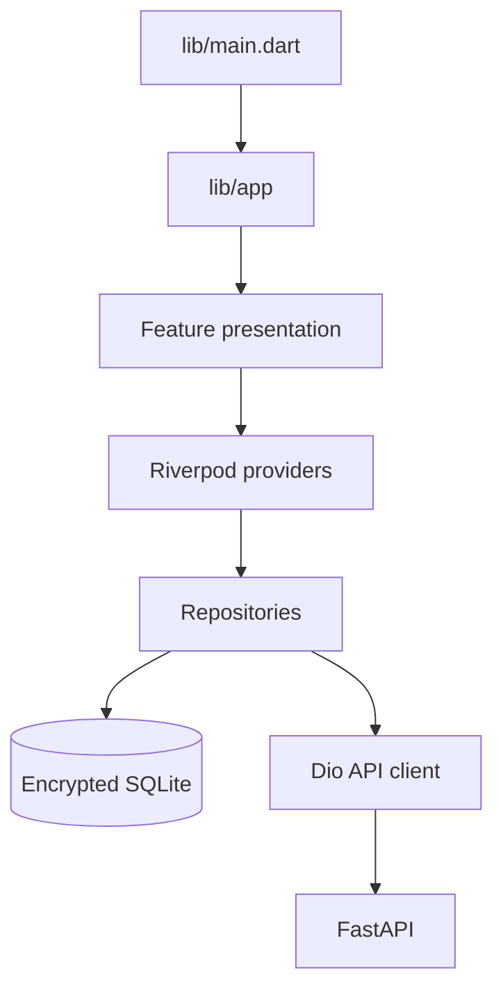

# Flutter Study Guide

The Flutter application presents workflows, manages client state, stores encrypted local data, and calls FastAPI. It displays backend financial results instead of recalculating them.

## Frontend map



| Location | Responsibility |
| --- | --- |
| `lib/app/` | Application shell, routing, and theme |
| `lib/core/database/` | SQLite schema and lifecycle |
| `lib/core/network/` | API configuration, authentication, errors, and sync |
| `lib/core/security/` | Local encryption and secure storage |
| `lib/features/auth/` | Login and session behavior |
| `lib/features/borrowers/` | Borrower CRUD and local/remote repositories |
| `lib/features/loans/` | Portfolio list, creation, schedule, payment, and statement UI |
| `lib/features/dashboard/` | Backend projection display and navigation |
| `lib/features/settings/` | Development tools and offline-sync controls |

## Recommended reading order

1. `lib/main.dart` and `lib/app/`
2. Authentication screens, repository, token storage, and Dio interceptor
3. Borrower model, providers, local repository, and remote repository
4. Loans Portfolio page, filters, search, and provider state
5. Loan creation and backend schedule response
6. Loan detail, payment preview, confirmation, and history
7. Dashboard projection mapping
8. Offline queue creation and drain behavior
9. Settings and development-data tools
10. Matching unit and widget tests

## Financial UI rule

Flutter may parse decimal strings, validate user input, and format money for display. It must not independently derive authoritative interest, principal allocations, remaining balances, receipt totals, statement totals, portfolio summaries, or reports.

## Important current flows

- The Loans Portfolio provides `All`, `Active`, `Overdue`, and `Paid` status filters plus borrower/loan-ID search.
- Loan forms submit exact terms and a stable request UUID.
- Payment screens request a backend preview before confirmation.
- Receipt and statement views consume backend projection responses.
- Dashboard cards consume backend projection metrics.
- Offline queue items retain transaction UUID, endpoint, method, payload, and creation time.
- Settings contains development-only seed/reset tooling; destructive actions must be clearly labeled.

## Run and verify

```powershell
flutter pub get
flutter run --dart-define=API_BASE_URL=http://10.0.2.2:8000
dart format lib test
flutter analyze
flutter test
```

Use `127.0.0.1` for Windows/web, `10.0.2.2` for the Android emulator, and the development computer's LAN IP for a physical device.

## Exercises

1. Trace a backend validation error into a user-visible form message.
2. Write a widget test for the Paid filter empty state.
3. Display failed offline-sync items without deleting them.
4. Add a loading and retry state to a projection screen.
5. Confirm a financial screen uses backend fields without duplicating its calculation.
