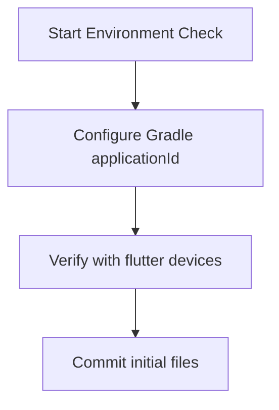

# Phase Visual Flowchart

## Objectives
* Goal: Initialize local Flutter project workspace and confirm compiler versions.

## Flowchart

## Entry Requirements
* Dependencies: None
* Ensure previous phase objectives are completed and verified.

## Exit Requirements
* Status: **Completed**
* All deliverables are verified.

## Deliverables
* Files: android/app/build.gradle.kts, pubspec.yaml

## Related Documentation
* [Phase Overview](OVERVIEW.md)
* [Phase Checklist](CHECKLIST.md)
* [Phase Flow Progression](FLOW.md)
