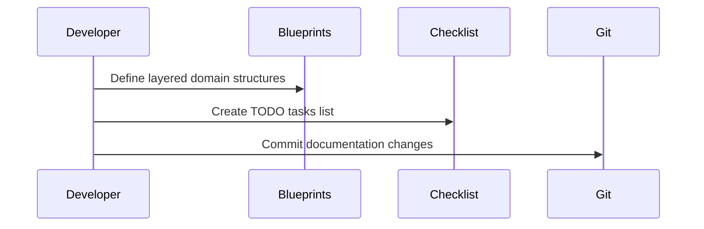

# Work Progression Flow

This sequence diagram details the work progression and data flows for the Documentation and Architecture implementation.

```mermaid
sequenceDiagram
    Developer->>Blueprints: Define layered domain structures
    Developer->>Checklist: Create TODO tasks list
    Developer->>Git: Commit documentation changes
```
