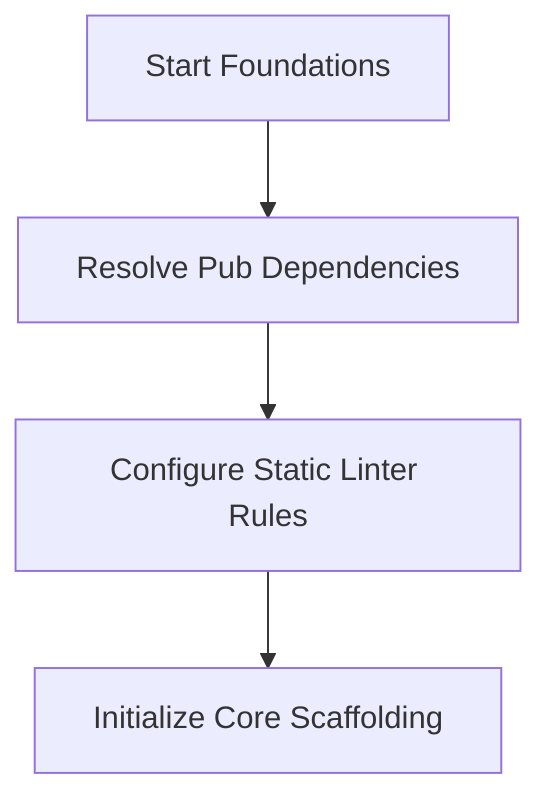

# Phase Visual Flowchart

## Objectives
* Goal: Add third-party packages and structure base app settings.

## Flowchart

## Entry Requirements
* Dependencies: Phase 01
* Ensure previous phase objectives are completed and verified.

## Exit Requirements
* Status: **In Progress**
* All deliverables are verified.

## Deliverables
* Files: pubspec.yaml, lib/main.dart

## Related Documentation
* [Phase Overview](OVERVIEW.md)
* [Phase Checklist](CHECKLIST.md)
* [Phase Flow Progression](FLOW.md)
