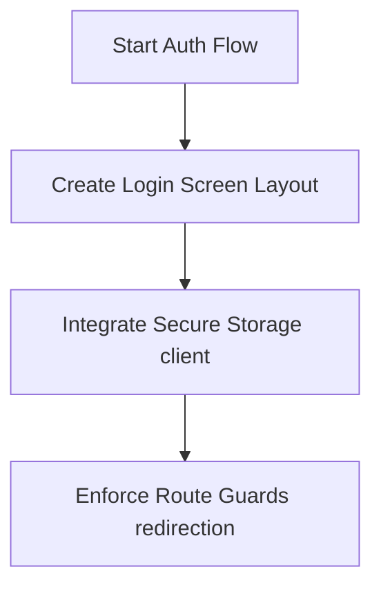

# Phase Visual Flowchart

## Objectives
* Goal: Secure the application entry and verify user sessions.

## Flowchart

## Entry Requirements
* Dependencies: Phase 03
* Ensure previous phase objectives are completed and verified.

## Exit Requirements
* Status: **Planned**
* All deliverables are verified.

## Deliverables
* Files: lib/features/authentication/*

## Related Documentation
* [Phase Overview](OVERVIEW.md)
* [Phase Checklist](CHECKLIST.md)
* [Phase Flow Progression](FLOW.md)
