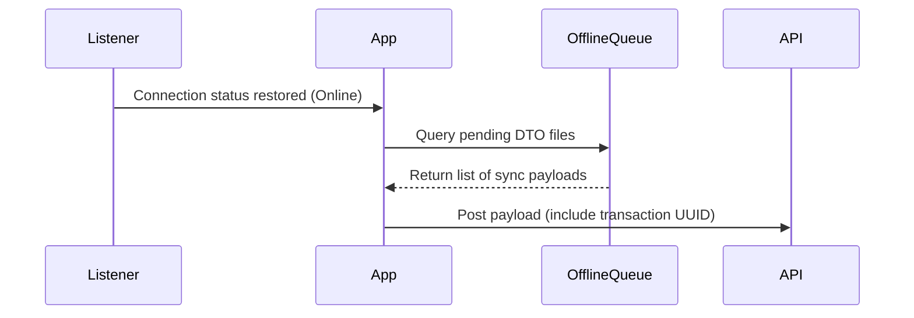

# Work Progression Flow

This sequence diagram details the work progression and data flows for the Offline Storage and Synchronization implementation.

```mermaid
sequenceDiagram
    Listener->>App: Connection status restored (Online)
    App->>OfflineQueue: Query pending DTO files
    OfflineQueue-->>App: Return list of sync payloads
    App->>API: Post payload (include transaction UUID)
```
