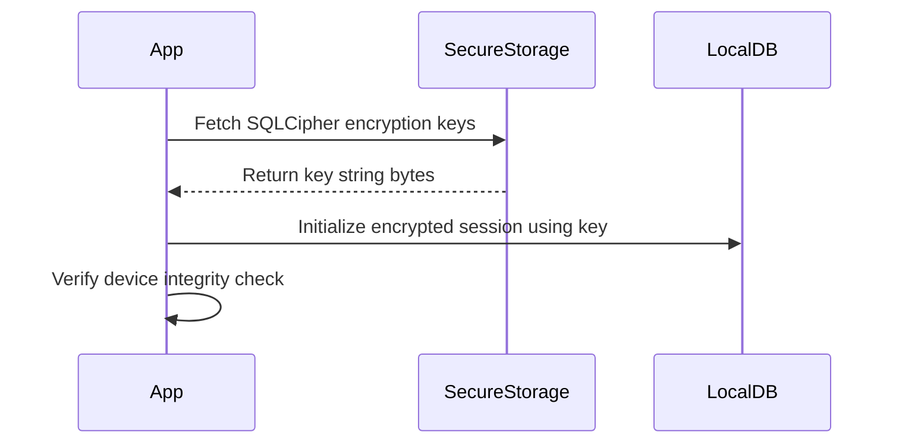

# Work Progression Flow

This sequence diagram details the work progression and data flows for the Security Hardening implementation.

```mermaid
sequenceDiagram
    App->>SecureStorage: Fetch SQLCipher encryption keys
    SecureStorage-->>App: Return key string bytes
    App->>LocalDB: Initialize encrypted session using key
    App->>App: Verify device integrity check
```
