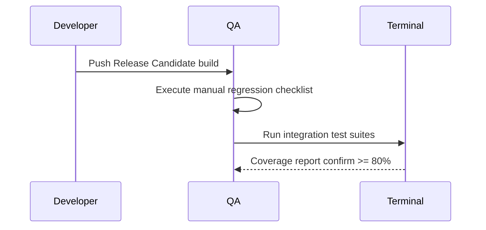

# Work Progression Flow

This sequence diagram details the work progression and data flows for the Testing and Quality Assurance implementation.

```mermaid
sequenceDiagram
    Developer->>QA: Push Release Candidate build
    QA->>QA: Execute manual regression checklist
    QA->>Terminal: Run integration test suites
    Terminal-->>QA: Coverage report confirm >= 80%
```
