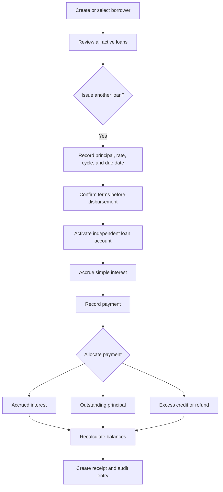
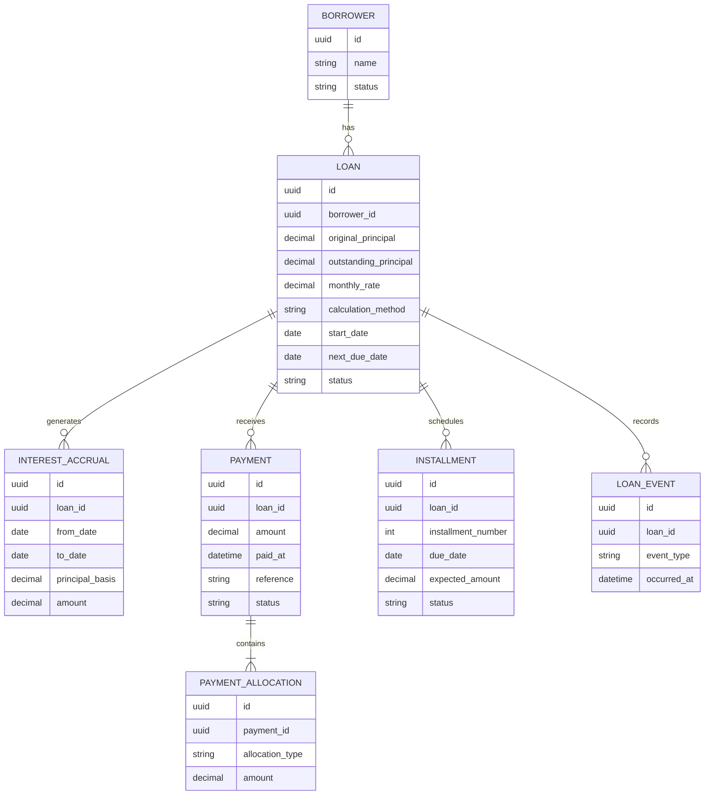

# Personal Lending App Roadmap

## Product vision

Lending Nelson will help a private lender record money lent to borrowers,
calculate agreed interest, accept flexible payments, and preserve a clear
history of every balance change.

The planned app supports situations where:

- a lender charges an agreed rate such as 10% per month;
- the lender selects a different agreed rate for each loan;
- the borrower requests a term and payment frequency for lender approval;
- one borrower has more than one active loan;
- a borrower pays only the interest for a period;
- a borrower makes a partial payment;
- a borrower pays early or in the middle of a monthly cycle;
- a borrower pays several days after the due date; and
- an existing loan remains unpaid when a new loan is issued.

This roadmap describes software behavior, not legal or financial advice.
Interest limits, disclosures, licensing, privacy, collections, and tax rules
must be reviewed for the jurisdiction where the app will be used.

## Recommended product flow

## Roadmap documents

Recommended reading order:

1. [Roadmap Overview](README.md) explains the product direction and domain model.
2. [Loan and Payment Rules](LOAN_RULES.md) defines calculation behavior and examples.
3. [Delivery Milestones](MILESTONES.md) breaks implementation into safe phases.

Keep business decisions in `LOAN_RULES.md`, implementation order in
`MILESTONES.md`, and completed learning evidence in the
[Student Progress Tracker](../progress/README.md).

## Core design principles

1. Every loan is independent, even when loans share a borrower.
2. Never overwrite financial history; corrections use reversal entries.
3. Store money in the smallest currency unit or an exact decimal type.
4. Store rates and calculation methods used at the time of agreement.
5. Let the lender choose each loan's rate and preview the resulting interest.
6. Show the lender a calculation preview before saving a payment.
7. Keep unpaid interest separate from principal by default.
8. Require explicit confirmation before issuing another active loan.
9. Record who performed each financial action and when.

## Proposed domain model

## Version-one decisions and production review

The version-one examples use daily-prorated, non-compounding interest on
outstanding principal with interest-first payment allocation. Before production,
the lender must confirm and disclose these rules rather than letting the code
silently change them:

- fixed monthly interest versus daily prorated monthly interest;
- interest based on original principal versus outstanding principal;
- payment allocation order;
- grace periods and late fees;
- whether unpaid interest may ever be added to principal;
- maximum total exposure per borrower;
- treatment of excess or advance payments; and
- currency and rounding policy.
